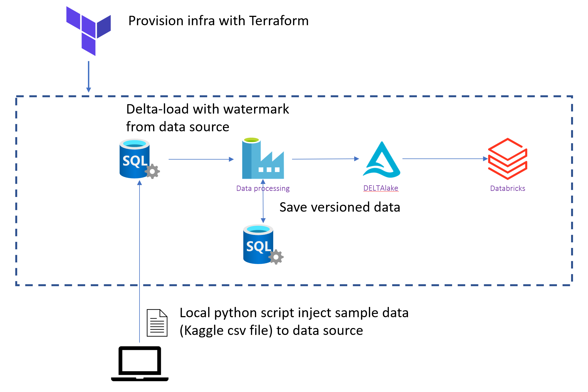

Description: 
- Code samples showcasing how to apply Data Mesh concepts with DevOps with Modern Data Warehouse Architecture leveraging different Azure Sevices.

Disclaimer:
- In case, [a] *you're willing to contribute to the FOSS Community for Data MESH*, or, [b] *require full access to the code-set for Academic/Not-for-profit purposes*, Please reach me @[DeepHiveMind Contact](https://deephivemind.io/contact.html). I may grant you the full access to my another private repo with the full code sets (in due conformance with "Copyright 2019 DeepHiveMind License").

DataMesh-as-a-Code on Azure Cloud - High Level Technology View:  

	- Technology & Tools 

		-- Azure Purview			[Data Provenance engine]
		-- Azure Synapse Analytics	[Node on Domain driven storage- Azure MPP DWH]
		-- Azure CosmosDB			[Node on Domain driven storage- MultiDomain NOSQL DB ]
		-- Azure Data Lake			[Node on Domain driven storage- Data Lake Storage]
		-- Azure Stream Analytics	[Stream Analytics engine]
		-- Azure Data Explorer		[Data Exploration Service]
		-- Presidio					[Data Protection and PII Anonymization API]
		-- Azure Data Factory		[Data Ingestion engine]
		-- Azure DataBricks 		[Data Integration engine]

		-- Azure Function 			[MicroService Serverless engine]
		-- Azure App Logic			[MicroService Serverless Orachsteration engine]
		
		-- IaC ARM Templates		[IaC engine]
		-- Azure Vnet & SubNet		[Azure Virtual Network & Sub Network]
		-- Azure DevOps 			[DevOps Service]
		-- Azure Key Valut			[Key Security]
		-- Azure App Insight 		[Azure Application Monitoring & Telemetry Service engine]
		-- Private Endpoint			[Network interface connects you privately and securely to Azure service]
		-- Azure Private DNS		[Azure DNS not only supports internet-facing DNS domains, but it also supports private DNS zones.]
		-- Azure AKS for Data Domain KnowledgeGraph			[Azure Managed K8S Services for managing ontology services]
		-- Istio on AKS 				[Service Mesh for Service Independence, Dynamic Service discovery, circuit breaking, mTLS b/w service-to-service communication]
		-- Azure DevOps					[Devops as one of the Modern DataOps drivers]
		
		-- Domain Ontology on CosmosDB			[Knowledge Graph]		
		-- WebOntology & Protege				[Knowledge Graph]
	 

## Technology Samples

- [Azure Purview](single_tech_samples/purview/)
  - [IaC - Azure Purview](single_tech_samples/purview/)
- [Data Factory](single_tech_samples/datafactory/)
  - [CI/CD - ADF](single_tech_samples/datafactory/)
- [Azure Databricks](single_tech_samples/databricks/)
  - [IaC - Basic Azure Databricks deployment](single_tech_samples/databricks/sample1_basic_azure_databricks_environment/)
  - [IaC - Enterprise Security and Data Exfiltration Protection Deployment](single_tech_samples/databricks/sample2_enterprise_azure_databricks_environment/)
  - [IaC - Cluster Provisioning and Secure Data Access](single_tech_samples/databricks/sample3_cluster_provisioning_and_data_access/)
- [Stream Analytics](single_tech_samples/streamanalytics/)
- [Azure SQL](single_tech_samples/azuresql/)
 - [CI/CD - AzureSQL](single_tech_samples/azuresql/)

## Industrialization Samples

- [**Parking Sensor Solution**](e2e_samples/parking_sensors/) 
	- This demonstrates batch, end-to-end data pipeline following the MDW architecture, along with a corresponding CI/CD process. See [here](https://www.youtube.com/watch?v=Xs1-OU5cmsw) for the presentation which includes a detailed walk-through of the solution.

- [**Temperature Events Solution**](e2e_samples/temperature_events) 
	- This demonstrate a high-scale event-driven data pipeline with a focus on how to implement Observability and Load Testing.

- [**Dataset Versioning Solution**](e2e_samples/dataset_versioning) 
	- This demonstrates how to use DataFactory to Orchestrate DataFlow, to do DeltaLoads into DeltaLake On DataLake.

- [**MDW Data Governance and PII data detection**](e2e_samples/mdw_governance) 
	- This sample demonstrates how to deploy the Infrastructure of an end-to-end MDW Pipeline using [Azure DevOps pipelines](https://azure.microsoft.com/en-au/services/devops/pipelines/) along with a focus around Data Governance and PII data detection.

  
  - *Technology stack*: Azure DevOps, Azure Data Factory, Azure Databricks, Azure Purview, [Presidio](https://github.com/microsoft/presidio)
  - Infrastructure as Code (IaC)
  - Build and Release Pipelines (CI/CD)
  - Testing
  - Observability / Monitoring

