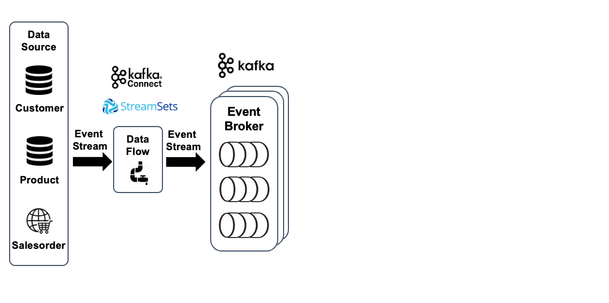
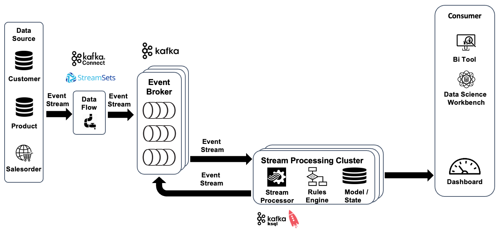
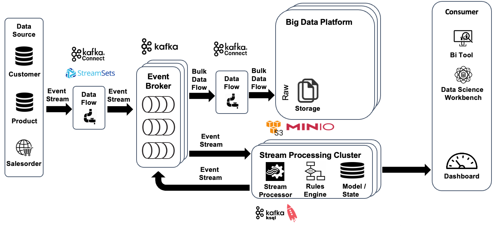
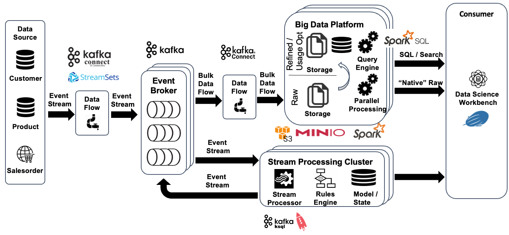
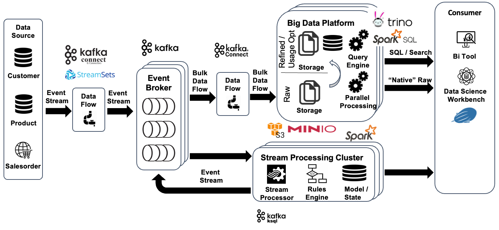

# Data Mesh Demo

This sample shows various aspects of the Data Mesh sample implementation. 

## Ingesting Data from Data Sources into Kafka




```sql
UPDATE address_t SET city = UPPER(city), modified_date = CURRENT_TIMESTAMP
WHERE address_id = 15978;

UPDATE person_t SET modified_date = CURRENT_TIMESTAMP
WHERE business_entity_id = 6943;

COMMIT;
```

## Processing Orders in real-time using ksqlDB

In the 2nd step, we will be using a Stream Analytics component called [ksqlDB](https://ksqldb.io/) to process the Orders from the `pub.ecomm.salesorder.order-completed.event.v1` Kafka topic in real-time. ksqlDB offers a familiar SQL-like dialect, which we can use to query from data streams.



We first start the ksqlDB CLI and connect to the ksqlDB engine

``` bash
docker exec -it ksqldb-cli ksql http://ksqldb-server-1:8088
```

Now we have to tell ksqlDB the structure of the data in the topic, as the Kafka topic itself is "schema-less", the Kafka cluster doesn't know about the structure of the message. We do that by creating a STREAM object, which we map onto the Kafka topic `tweet-json`.

```sql
CREATE OR REPLACE STREAM pub_order_completed_event_s
	WITH (KAFKA_TOPIC='pub.ecomm.salesorder.order-completed.event.v1',
		  VALUE_FORMAT='AVRO',
		  KEY_FORMAT='KAFKA'
		  );
```

```sql
describe pub_order_completed_event_s;

Name                 : PUB_ORDER_COMPLETED_EVENT_S
 Field | Type
-----------------------------------------------------------------------------------------------------------------------------------------------------------------------------------------------------------------------------------------------------------------------------------------------------------------------------------------------------------------------------------------------------------------------------------------------------------------------------------
 ORDER | STRUCT<ID BIGINT, ORDERNO VARCHAR(STRING), ORDERDATE TIMESTAMP, ORDERSTATUS VARCHAR(STRING), CURRENCYCODE VARCHAR(STRING), BILLINGADDRESS STRUCT<ID BIGINT, SALUTATION VARCHAR(STRING), FIRSTNAME VARCHAR(STRING), LASTNAME VARCHAR(STRING), ADDITIONALADDRESSLINE1 VARCHAR(STRING), ADDITIONALADDRESSLINE2 VARCHAR(STRING), STREET VARCHAR(STRING), ZIPCODE VARCHAR(STRING), CITY VARCHAR(STRING), COUNTRY STRUCT<ISOCODE2 VARCHAR(STRING), ISOCODE3 VARCHAR(STRING), NUMERICCODE INTEGER, SHORTNAME VARCHAR(STRING)>>, SHIPPINGADDRESS STRUCT<ID BIGINT, SALUTATION VARCHAR(STRING), FIRSTNAME VARCHAR(STRING), LASTNAME VARCHAR(STRING), ADDITIONALADDRESSLINE1 VARCHAR(STRING), ADDITIONALADDRESSLINE2 VARCHAR(STRING), STREET VARCHAR(STRING), ZIPCODE VARCHAR(STRING), CITY VARCHAR(STRING), COUNTRY STRUCT<ISOCODE2 VARCHAR(STRING), ISOCODE3 VARCHAR(STRING), NUMERICCODE INTEGER, SHORTNAME VARCHAR(STRING)>>, CUSTOMER STRUCT<ID BIGINT, NAME VARCHAR(STRING)>, ITEMS ARRAY<STRUCT<CREATEDAT TIMESTAMP, QUANTITY INTEGER, UNITPRICE DOUBLE, PRODUCT STRUCT<PRODUCTID BIGINT, NAME VARCHAR(STRING)>>>>
-----------------------------------------------------------------------------------------------------------------------------------------------------------------------------------------------------------------------------------------------------------------------------------------------------------------------------------------------------------------------------------------------------------------------------------------------------------------------------------
For runtime statistics and query details run: DESCRIBE <Stream,Table> EXTENDED;
```

We don't map all the properties of the tweet, only some we are interested in.

Now with the STREAM in place, we can use the SELECT statement to query from it

```sql
SELECT * FROM pub_order_completed_event_s EMIT CHANGES;
```

We have to specify the `EMIT CHANGES`, as we are querying from a stream and with that the data is continuously pushed into the query (so called push query).

We can also selectively only return the data we are interested in, i.e. the `id`, the `text` and the `source` fields.

```sql
SELECT order->id, order->customer->name FROM pub_order_completed_event_s EMIT CHANGES;
```

We can refine the data


```sql
DROP STREAM IF EXISTS pub_order_completed_event_item_s;

CREATE OR REPLACE STREAM pub_order_completed_event_item_s
	WITH (KAFKA_TOPIC='priv.ecomm.salesorder.order-completed-item.event.v1',
		  VALUE_FORMAT='AVRO',
		  KEY_FORMAT='KAFKA'
		  )
AS SELECT order->id				                AS order_id
, explode(order->items)->quantity
, explode(order->items)->unitprice            AS unit_price
, explode(order->items)->product->productid   AS product_id
, explode(order->items)->product->name 	      AS product_name
FROM pub_order_completed_event_s  
emit changes;
```

This produces a Stream Analytics job which now continuously run in the background and read from the `order_raw_s`, flattens the hashtags and produces the result into the newly created `order_s` stream.

Let's only see the orders which are > 1000. We have to cast to double because we are using the raw data.

```sql
SELECT order_id
	, SUM(quantity * unit_price) AS order_amount
FROM pub_order_completed_event_item_s 
GROUP BY order_id
HAVING SUM(quantity * unit_price) > 1000
EMIT CHANGES;
```

Return the how many times a product has been ordered within 60 seconds

```sql
SELECT FROM_UNIXTIME(windowstart)		as from_ts
, FROM_UNIXTIME(windowend)		as to_ts
, product_id
, product_name
, count(*) AS count
FROM pub_order_completed_event_item_s 
WINDOW TUMBLING (SIZE 60 seconds) 
GROUP BY product_id, product_name
EMIT CHANGES;
```

By using the `EMIT FINAL`, we specify that we only want to get a result at the end of the window.

```sql
SELECT FROM_UNIXTIME(windowstart)		as from_ts
, FROM_UNIXTIME(windowend)		as to_ts
, product_id
, product_name
, count(*) AS count
FROM pub_order_completed_event_item_s 
WINDOW TUMBLING (SIZE 60 seconds) 
GROUP BY product_id, product_name
EMIT FINAL;
```

## Moving Data from Kafka to S3 (Minio)

In the 3rd step, we will ingest the data from Kafka into the "Big Data Storage", i.e. using Object Storage (S3 = Minio).  



First create the necessary bucket

```bash
docker exec -ti awscli s3cmd mb s3://demo-bucket
```

The [S3 Sink Connector](https://docs.confluent.io/kafka-connect-s3-sink/current/overview.html) is already pre-installed with the Dataplatform. 

To create a connector, you can use the [REST API](https://docs.confluent.io/platform/current/connect/references/restapi.html) provided by Kafka Connect.

Create the connector to upload the `pub.ecomm.salesorder.order-completed.event.v1 ` topic to S3:

```bash
curl -X "POST" "$DOCKER_HOST_IP:8083/connectors" \
     -H "Content-Type: application/json" \
     --data '{
  "name": "salesorder.s3.sink",
  "config": {
      "connector.class": "io.confluent.connect.s3.S3SinkConnector",
      "partitioner.class": "io.confluent.connect.storage.partitioner.HourlyPartitioner",
      "partition.duration.ms": "300000",
      "flush.size": "2000",
      "topics": "pub.ecomm.salesorder.order-completed.event.v1",
      "tasks.max": "1",
      "timezone": "Europe/Zurich",
      "locale": "en",
      "schema.generator.class": "io.confluent.connect.storage.hive.schema.DefaultSchemaGenerator",
      "storage.class": "io.confluent.connect.s3.storage.S3Storage",
      "format.class": "io.confluent.connect.s3.format.avro.AvroFormat",
      "s3.region": "us-east-1",
      "s3.bucket.name": "pub.ecomm.salesorder.bucket",
      "topics.dir": "refined/salesorder.state.v1",
      "s3.part.size": "5242880",
      "store.url": "http://minio-1:9000",
      "key.converter": "org.apache.kafka.connect.storage.StringConverter"
  }
}'
```

To check which connectors are running, you can either use the REST API as well

```bash
curl --silent -X GET http://dataplatform:8083/connectors | jq
```

or view it in Kafka Connect UI by navigating to <http://dataplatform:28103>

Navigate to the MinIO Browser on <http://dataplatform:9000> and check that the bucket is being filled.


## Processing Data using Apache Spark

In the 4th step, we will be using [Apache Spark](https://spark.apache.org/) to process the tweets we have stored in object storage. We will be using Apache Zeppelin for executing the Apache Spark statements in an "ad-hoc" fashion.



Navigate to <http://dataplatform:28080> to open Apache Zeppelin and login as user `admin` with password `abc123!`. Create a new notebook using the **Create new note** link.

### Working with Raw Data

Now let's read all the data we have stored to MinIO object storage so far, using the `spark.read.format("avro").load` command

```scala
val orderDF = spark.read.format("avro").load("s3a://ecomm.salesorder.bucket/raw/salesorder.state.v1/pub.ecomm.salesorder.order-completed.event.v1")
```

Spark returns the result as a Data Frame, which is backed by a schema, derived from the JSON structure. We can use the `printSchema` method on the data frame to view the schema.

```scala
orderDF.printSchema()

root
 |-- order: struct (nullable = true)
 |    |-- id: long (nullable = true)
 |    |-- orderNo: string (nullable = true)
 |    |-- orderDate: timestamp (nullable = true)
 |    |-- orderStatus: string (nullable = true)
 |    |-- currencyCode: string (nullable = true)
 |    |-- billingAddress: struct (nullable = true)
 |    |    |-- id: long (nullable = true)
 |    |    |-- salutation: string (nullable = true)
 |    |    |-- firstName: string (nullable = true)
 |    |    |-- lastName: string (nullable = true)
 |    |    |-- additionalAddressLine1: string (nullable = true)
 |    |    |-- additionalAddressLine2: string (nullable = true)
 |    |    |-- street: string (nullable = true)
 |    |    |-- zipcode: string (nullable = true)
 |    |    |-- city: string (nullable = true)
 |    |    |-- country: struct (nullable = true)
 |    |    |    |-- isoCode2: string (nullable = true)
 |    |    |    |-- isoCode3: string (nullable = true)
 |    |    |    |-- numericCode: integer (nullable = true)
 |    |    |    |-- shortName: string (nullable = true)
 |    |-- shippingAddress: struct (nullable = true)
 |    |    |-- id: long (nullable = true)
 |    |    |-- salutation: string (nullable = true)
 |    |    |-- firstName: string (nullable = true)
 |    |    |-- lastName: string (nullable = true)
 |    |    |-- additionalAddressLine1: string (nullable = true)
 |    |    |-- additionalAddressLine2: string (nullable = true)
 |    |    |-- street: string (nullable = true)
 |    |    |-- zipcode: string (nullable = true)
 |    |    |-- city: string (nullable = true)
 |    |    |-- country: struct (nullable = true)
 |    |    |    |-- isoCode2: string (nullable = true)
 |    |    |    |-- isoCode3: string (nullable = true)
 |    |    |    |-- numericCode: integer (nullable = true)
 |    |    |    |-- shortName: string (nullable = true)
 |    |-- customer: struct (nullable = true)
 |    |    |-- id: long (nullable = true)
 |    |    |-- name: string (nullable = true)
 |    |-- items: array (nullable = true)
 |    |    |-- element: struct (containsNull = true)
 |    |    |    |-- createdAt: timestamp (nullable = true)
 |    |    |    |-- quantity: integer (nullable = true)
 |    |    |    |-- unitPrice: double (nullable = true)
 |    |    |    |-- product: struct (nullable = true)
 |    |    |    |    |-- productId: long (nullable = true)
 |    |    |    |    |-- name: string (nullable = true)
 |-- year: integer (nullable = true)
 |-- month: integer (nullable = true)
 |-- day: integer (nullable = true)
 |-- hour: integer (nullable = true)
```


Let`s see some records of the `orderDF` data frame

```scala
orderDF.show

+--------------------+----+-----+---+----+
|               order|year|month|day|hour|
+--------------------+----+-----+---+----+
|{68942, null, 202...|2022|    6| 16|  23|
|{68905, null, 202...|2022|    6| 16|  23|
|{68924, null, 202...|2022|    6| 16|  23|
|{69024, null, 202...|2022|    6| 16|  23|
|{68961, null, 202...|2022|    6| 16|  23|
|{69010, null, 202...|2022|    6| 16|  23|
|{68956, null, 202...|2022|    6| 16|  23|
|{68984, null, 202...|2022|    6| 16|  23|
|{69081, null, 202...|2022|    6| 16|  23|
|{69063, null, 202...|2022|    6| 16|  23|
|{69039, null, 202...|2022|    6| 16|  23|
|{69034, null, 202...|2022|    6| 16|  23|
|{69073, null, 202...|2022|    6| 16|  23|
|{69071, null, 202...|2022|    6| 16|  23|
|{69066, null, 202...|2022|    6| 16|  23|
|{69067, null, 202...|2022|    6| 16|  23|
|{69043, null, 202...|2022|    6| 16|  23|
|{69151, null, 202...|2022|    6| 16|  23|
|{69092, null, 202...|2022|    6| 16|  23|
|{69109, null, 202...|2022|    6| 16|  23|
+--------------------+----+-----+---+----+
only showing top 20 rows
```

We can also ask the data frame for the number of records, using the `count` method

```scala
orderDF.count()
```

To restrict on the time period

```scala
val pYear = "2022"
val pMonth = "06"
val pDay = "17"
val pHour = "10"

val orderFilteredDF = orderDF.where(col("year") === pYear and col("month") === pMonth and col("day") === pDay and col("hour") === pHour)

orderFilteredDF.count()
```

### Registering as Spark SQL tables

Spark SQL allows to use the SQL language to work on the data in a data frame. We can register a table on a data frame.

```scala
orderDF.createOrReplaceTempView("order_t")
```

With the `order_t ` table registered, we can use it in a SELECT statement. Inside spark, you can use the `spark.sql()` to execute the SELECT statement.

But with Zeppelin, there is also the possibility to use the `%sql` directive to directly work on the tables registered

```sql
 %sql
SELECT * FROM order_t;
```

We can also do the count using SQL

```sql
%sql
SELECT COUNT(*) FROM order_t;
```

We can access the structure

```sql
%sql
SELECT o.order.id
,      o.order.orderno
,      o.order.orderdate
,      o.order.orderstatus
,      o.order.billingAddress
FROM  order_t o
```

### Refinement

```sql
%sql
SELECT o.order.id
, o.order.customer.id      AS customer_id
, item.quantity
, item.unitPrice           AS unit_price
, item.product.productId   AS product_id
, item.product.name        AS product_name
FROM order_t o
LATERAL VIEW explode (o.order.items) items AS item;
```

### Calculate Total Amount of Ordered Goods by Customer

```sql
%sql
SELECT customer_id, SUM (unit_price * quantity)
FROM (
    SELECT o.order.id
    , o.order.customer.id      AS customer_id
    , item.quantity
    , item.unitPrice           AS unit_price
    , item.product.productId   AS product_id
    , item.product.name        AS product_name
    FROM order_t o
    LATERAL VIEW explode (o.order.items) items AS item
) GROUP BY customer_id;
```

```scala
val orderAmountByCustomerDF = spark.sql("""

SELECT customer_id, SUM (unit_price * quantity)      order_amount
FROM (
    SELECT o.order.id
    , o.order.customer.id      AS customer_id
    , item.quantity
    , item.unitPrice           AS unit_price
    , item.product.productId   AS product_id
    , item.product.name        AS product_name
    FROM order_t o
    LATERAL VIEW explode (o.order.items) items AS item
) GROUP BY customer_id;

""")
```

The result of the `spark.sql` is another, new data frame, which we can either do further processing on, or store it using the `write.parquet` method

### Store it in S3

as json

```scala
orderAmountByCustomerDF.write.json("s3a://ecomm.salesorder.bucket/result/json/orderAmountByCustomer")
```

as parquet

```scala
orderAmountByCustomerDF.write.parquet("s3a://ecomm.salesorder.bucket/result/parquet/orderAmountByCustomer")
```

We store it in Minio object storage in the same bucket as the raw data, but use another path `result/parquet/orderAmountByCustomer` so that we can distinguish the raw order data from the `orderAmountByCustomer ` data. We also no longer use json as the data format but the more efficient parquet data format.

## Using Trino to query the result in object storage

In this last step, we are using [Trino](https://trino.io/) engine to make the result data we have created in the previous step available for querying over SQL.



To make the data in object storage usable in Trino, we first have to create the necessary meta data in the Hive Metastore. The Hive Metastore is similar to a data dictionary in the relational world, it stores the meta information about the data stored somewhere else, such as in object storage.

We first start the Hive Metastore CLI

```bash
docker exec -ti hive-metastore hive
```

and create a database

```sql
CREATE DATABASE pub_ecomm_salesorder;
```

and then switch to that database

```sql
USE pub_ecomm_salesorder;
```

Databases allow to group similar data.

Inside the database, we can now create a table, which wraps the data in object storage. We create a table for each sub-folder below the `raw` folder

```sql
DROP TABLE IF EXISTS salesorder_completed_event_t;

CREATE EXTERNAL TABLE salesorder_completed_event_t
PARTITIONED BY (year string, month string, day string, hour string)
ROW FORMAT SERDE 'org.apache.hadoop.hive.serde2.avro.AvroSerDe'
STORED AS INPUTFORMAT 'org.apache.hadoop.hive.ql.io.avro.AvroContainerInputFormat'
  OUTPUTFORMAT 'org.apache.hadoop.hive.ql.io.avro.AvroContainerOutputFormat'
LOCATION 's3a://ecomm.salesorder.bucket/raw/salesorder.state.v1/pub.ecomm.salesorder.order-completed.event.v1'
TBLPROPERTIES ('avro.schema.url'='s3a://ecomm.salesorder.bucket/avro/OrderCompletedEvent.avsc','discover.partitions'='false');  

MSCK REPAIR TABLE salesorder_completed_event_t SYNC PARTITIONS; 
```

With the table in place, we can quit the CLI using the `exit;` command.

Now let's start the Trino CLI and connect to the `trino-1` service

```bash
docker exec -ti trino-cli trino --server trino-1:8080 --catalog minio
```

We then switch to the `minio` catalog and the `twitter_data` database, which matches the name of the database we have created in the Hive Metastore before

```sql
use minio.pub_ecomm_salesorder;
```

A show tables should show the one table `salesorder_completed_event_t` we have created before

```sql
show tables;
```

Now we can use `SELECT` to query from the table

```sql
SELECT * FROM salesorder_completed_event_t;
```

Let's create a view to make result more strucutred


```sql
CREATE OR REPLACE VIEW order_aggr_v
AS
SELECT	o."order".id 			AS id
,	o."order".orderNo			AS order_no
,	o."order".orderDate			AS order_date
,	o."order".orderStatus		AS order_status
,	o."order".currencyCode		AS currency_code
,	o."order".billingAddress	AS billing_address
,	o."order".shippingAddress	AS shipping_address
,	o."order".customer			AS customer
,	o."order".items				AS items
FROM salesorder_completed_event_t o;
```


We can even go to a more relational views

```sql
CREATE OR REPLACE VIEW order_v
AS
SELECT	o."order".id 			AS id
,	o."order".orderNo			AS order_no
,	o."order".orderDate			AS order_date
,	o."order".orderStatus		AS order_status
,	o."order".currencyCode		AS currency_code
,	o."order".billingAddress.id	AS billing_address_id
,	o."order".billingAddress.salutation	AS billing_address_salutation
,	o."order".billingAddress.firstName	AS billing_address_first_name
,	o."order".billingAddress.lastName	AS billing_address_last_name
,	o."order".billingAddress.additionaladdressline1	AS billing_address_additional_address_line1
,	o."order".billingAddress.additionaladdressline2	AS billing_address_additional_address_line2
,	o."order".billingAddress.street	AS billing_address_street
,	o."order".billingAddress.zipcode	AS billing_address_zipcode
,	o."order".billingAddress.city	AS billing_address_city
,	o."order".billingAddress.country.shortName	AS billing_address_country_name
,	o."order".shippingAddress	AS shipping_address
,	o."order".customer.id		AS customer_id
,   o."order".customer.name		AS customer_name
FROM salesorder_completed_event_t o;

CREATE OR REPLACE VIEW order_line_v
AS
SELECT	o."order".id	AS order_id
,   i.created_at
,	i.quantity
,	i.unit_price
,   i.product.productId		AS product_id
, 	i.product.name			AS product_name
FROM salesorder_completed_event_t	AS o
CROSS JOIN UNNEST (o."order".items) AS i(created_at,quantity,unit_price,product);
```

```sql
SELECT customer_id, SUM (unit_price * quantity)      total_order_amount
FROM order_line_v
GROUP BY customer_id;
```


```sql
SELECT customer_id
, SUM (unit_price * quantity)      total_order_amount
FROM order_line_v	ol
JOIN order_v			o
ON (ol.order_id = o.id)
GROUP BY customer_id;
```

### Register Hive tables for customer data

Start the Hive Metastore CLI

```bash
docker exec -ti hive-metastore hive
```

```
CREATE DATABASE pub_ecomm_customer;

USE pub_ecomm_customer;

DROP TABLE IF EXISTS customer_state_t;

CREATE EXTERNAL TABLE customer_state_t
PARTITIONED BY (year string, month string, day string, hour string)
ROW FORMAT SERDE 'org.apache.hadoop.hive.serde2.avro.AvroSerDe'
STORED AS INPUTFORMAT 'org.apache.hadoop.hive.ql.io.avro.AvroContainerInputFormat'
  OUTPUTFORMAT 'org.apache.hadoop.hive.ql.io.avro.AvroContainerOutputFormat'
LOCATION 's3a://pub_ecomm.customer.bucket/refined/customer.state.v1/pub.ecomm.customer.customer.state.v1'
TBLPROPERTIES ('avro.schema.url'='s3a://pub_ecomm.customer.bucket/avro/CustomerState.avsc','discover.partitions'='false');  

MSCK REPAIR TABLE customer_state_t SYNC PARTITIONS;
```

Now let's start the Trino CLI and connect to the `trino-1` service

```bash
docker exec -ti trino-cli trino --server trino-1:8080 --catalog minio
```

and create the `customer_v` "relational" view

```sql
use pub_ecomm_customer;

CREATE OR REPLACE VIEW customer_v
AS
SELECT	customer.id 		AS id
,	customer.personType		AS person_type
,	customer.nameStyle		AS name_style
,	customer.title 			AS title
,	customer.firstName		AS first_name
,	customer.middleName		AS middle_name
,	customer.lastName		AS last_name
,	customer.emailPromotion	AS email_promotion
FROM customer_state_t;
```

### Join order total by customer with customer data


```sql
SELECT c.*
, o.total_order_amount 
FROM (
	SELECT customer_id
	, SUM (unit_price * quantity)      total_order_amount
	FROM order_line_v	ol
	JOIN order_v			o
	ON (ol.order_id = o.id)
	GROUP BY customer_id
) o
LEFT JOIN ecomm_customer.customer_v	c
ON (o.customer_id = c.id)
```


Trino can be integrated into many standard data analytics tools, such as PowerBI or Tableau any many others.
