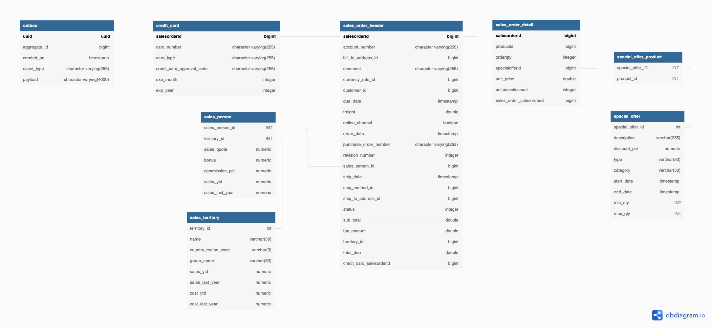

# Sales Order Subdomain - Order Processing Data Product

## Canvas


## Exposed Ports
 
 * Kafka 
   * `pub.ecomm.salesorder.order-completed.event.v1` - a topic with all completed orders with a data retention of 1 week

 * Object Storage
   * `pub.ecomm.salesorder.bucket`  
 * Trino
   * `pub_ecomm_salesorder` 

## Implementation


## (1) Initialize static data

The following StreamSets Pipelines are handling the initialization of the data

 * **[salesorder_init](http://140.238.174.129:18630/collector/pipeline/custsimul6647b714-e368-4a50-8af4-7f2d59ebce77)** - Initializes the static datasets

The data for the init has to be provided in `data-transfer/data-mesh-poc/simulator/sales-order/init`

## (2) Simulation

The following StreamSets Pipeline is simulating the data

 * **salesorder_simulate-order-online** - simulate new Online orders and updates to existing orders

The data for the simulator has to be provided in `data-transfer/data-mesh-poc/simulator/salesorder/`.

`sales_order_obj_online_events.csv`

```bash
descriminator,delay_from_start_ms,salesOrder
SalesOrderOnline,13000,'{"id":43701,"shipMethodId":1,"revisionNumber":8,"orderDate":"2011-05-31T00:00:00.000Z","dueDate":"2011-06-12T00:00:00.000Z","shipDate":"2011-06-07T00:00:00.000Z","status":5,"onlineOrderFlag":true,"accountNumber":"10-4030-011003","customerId":11003,"territoryId":9,"billToAddressId":20425,"shipToAddressId":20425,"currencyRateId":2,"subTotal":3399.990000000000000000,"taxAmount":271.999200000000000000,"freight":84.999800000000000000,"totalDue":3756.989000000000000000,"orderDetails":[{"id":357,"quantity":1,"productId":773,"specialOfferId":1,"unitPrice":3399.990000000000000000,"unitPriceDiscount":0}],"creditCard":{"id":11150,"cardType":"ColonialVoice","cardNumber":"77775658326712","expMonth":3,"expYear":2007,"creditCardApprovalCode":"335093Vi57504"}}'
SalesOrderOnline,47000,'{"id":43699,"shipMethodId":1,"revisionNumber":8,"orderDate":"2011-05-31T00:00:00.000Z","dueDate":"2011-06-12T00:00:00.000Z","shipDate":"2011-06-07T00:00:00.000Z","status":5,"onlineOrderFlag":true,"accountNumber":"10-4030-025863","customerId":25863,"territoryId":1,"billToAddressId":19613,"shipToAddressId":19613,"subTotal":3399.990000000000000000,"taxAmount":271.999200000000000000,"freight":84.999800000000000000,"totalDue":3756.989000000000000000,"orderDetails":[{"id":355,"quantity":1,"productId":773,"specialOfferId":1,"unitPrice":3399.990000000000000000,"unitPriceDiscount":0}],"creditCard":{"id":5796,"cardType":"SuperiorCard","cardNumber":"33334270131662","expMonth":4,"expYear":2008,"creditCardApprovalCode":"333376Vi30244"}}'
SalesOrderOnline,58000,'{"id":43697,"shipMethodId":1,"revisionNumber":8,"orderDate":"2011-05-31T00:00:00.000Z","dueDate":"2011-06-12T00:00:00.000Z","shipDate":"2011-06-07T00:00:00.000Z","status":5,"onlineOrderFlag":true,"accountNumber":"10-4030-021768","customerId":21768,"territoryId":6,"billToAddressId":23148,"shipToAddressId":23148,"currencyRateId":4,"subTotal":3578.270000000000000000,"taxAmount":286.261600000000000000,"freight":89.456800000000000000,"totalDue":3953.988400000000000000,"orderDetails":[{"id":353,"quantity":1,"productId":749,"specialOfferId":1,"unitPrice":3578.270000000000000000,"unitPriceDiscount":0}],"creditCard":{"id":4319,"cardType":"SuperiorCard","cardNumber":"33331901909188","expMonth":7,"expYear":2008,"creditCardApprovalCode":"530200Vi22686"}}'
...
```

## (3) Salesorder Management Service


A Rest API is deployed on <http://dataplatform:48081>

A `POST` on `/api/salesOrders` with a JSON document similar to the one below will add a new Person with addresses, emails and phones:

```json
{
  "id": 43836,
  "shipMethodId": 1,
  "revisionNumber": 8,
  "orderDate": "2011-06-29T00:00:00.000Z",
  "dueDate": "2011-07-11T00:00:00.000Z",
  "shipDate": "2011-07-06T00:00:00.000Z",
  "status": 5,
  "onlineOrderFlag": true,
  "accountNumber": "10-4030-026620",
  "customerId": 26620,
  "territoryId": 6,
  "billToAddressId": 19261,
  "shipToAddressId": 19261,
  "currencyRateId": 381,
  "subTotal": 699.0982,
  "taxAmount": 55.9279,
  "freight": 17.4775,
  "totalDue": 772.5036,
  "orderDetails": [
    {
      "id": 492,
      "quantity": 1,
      "productId": 761,
      "specialOfferId": 1,
      "unitPrice": 699.0982,
      "unitPriceDiscount": 0
    }
  ],
  "creditCard": {
    "id": 6966,
    "cardType": "Distinguish",
    "cardNumber": "55556839566975",
    "expMonth": 4,
    "expYear": 2008,
    "creditCardApprovalCode": "233797Vi36226"
  }
}
```

The API places the new order into the command topic `pub.ecomm.salesoder.new-order.command.v1` where it is picked up by the order processing.

### Data Model for Salesorder Domain

The internal Data Model for the Sales Order operational systems

   

### Persistence

The persistence mapping of the domain object to the data model is done using Java Persistence API. Each Domain Objects maps the data to tables using annotations.

`PersonRepositoryImpl.java`

```java
package com.trivadis.ms.sample.salesorder.model;

import lombok.*;

import javax.persistence.*;
import java.time.Instant;
import java.util.List;
import java.util.Set;

/**
 * Entity that maps the SalesOrderHeader table.
 */
@Data
@Builder
@ToString
@AllArgsConstructor
@NoArgsConstructor
@Entity
@Table(name = "SalesOrderHeader")
public class SalesOrderDO {

    @Id
//    @GeneratedValue(strategy = GenerationType.AUTO, generator="seq")
//    @GenericGenerator(name = "seq", strategy="increment")
    @Column(name = "salesOrderId")
    private Long id;

    @Column(name = "shipMethodId")
    private Long shipMethodId;
    @Column(name = "revisionNumber")
    private Integer revisionNumber;
    @Column(name = "orderDate")
    private Instant orderDate;
    @Column(name = "dueDate")
    private Instant dueDate;
    @Column(name = "shipDate")
    private Instant shipDate;
    @Column(name = "status")
    private OrderStatusEnum status;
    @Column(name = "onlineChannel")
    private Boolean onlineChannel;
    @Column(name = "purchaseOrderNumber")
    private String purchaseOrderNumber;
    @Column(name = "customerId")
    private Long customerId;
    @Column(name = "salesPersonId")
    private Long salesPersonId;
    @Column(name = "accountNumber")
    private String accountNumber;
    @Column(name = "territoryId")
    private Long territoryId;
    @Column(name = "billToAddressId")
    private Long billToAddressId;
    @Column(name = "shipToAddressId")
    private Long shipToAddressId;
    @Column(name = "currencyRateId")
    private Long currencyRateId;
    @Column(name = "currencyCode")
    private String currencyCode;
    @Column(name = "subTotal")
    private Double subTotal;
    @Column(name = "taxAmount")
    private Double taxAmount;
    @Column(name = "freight")
    private Double freight;
    @Column(name = "totalDue")
    private Double totalDue;
    @Column(name = "comment")
    private String comment;

    @OneToMany(cascade = CascadeType.ALL)
    @JoinColumn(name="sales_order_header_id", nullable = false)
    private Set<SalesOrderDetailDO> salesOrderDetails;

    @ManyToOne(optional = false)
    private CreditCardDO creditCard;
}
```

## (5) Transactional Outbox

```sql
```


