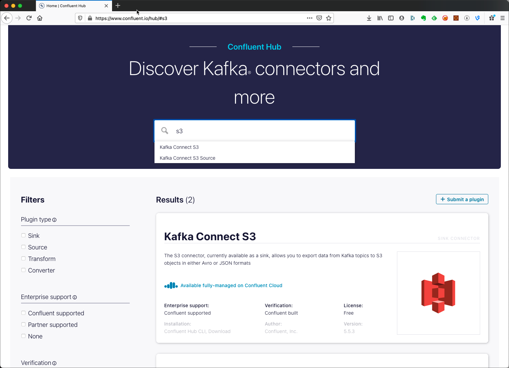
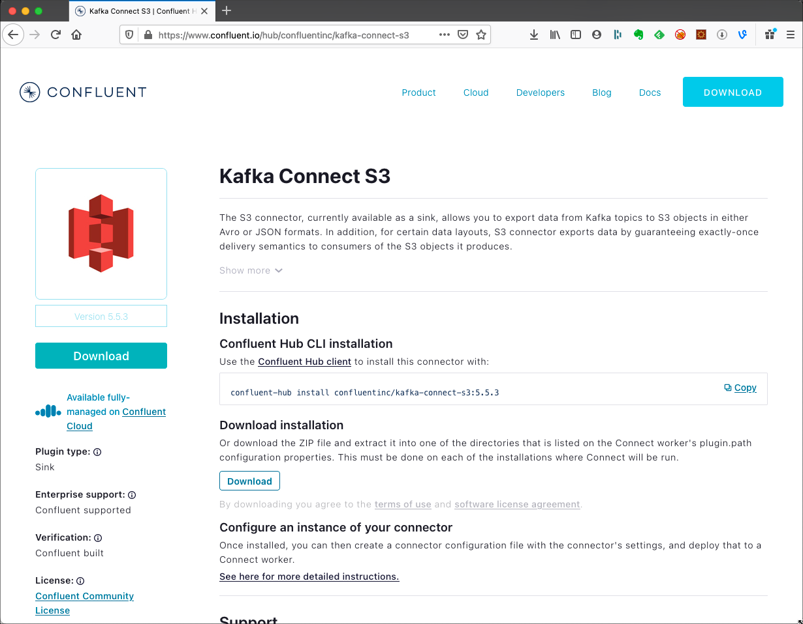

# Using additional Kafka Connect Connector

This recipe will show how to install an additional Kafka Connect Connector which is not part of the default platform. We will show two different versions, one installing it from the [Confluent Hub](https://www.confluent.io/hub/) and the other one by downloading a tar and copying it into the correct folder.

## Initialise data platform

First [initialise a platys-supported data platform](../documentation/getting-started) with the following services enabled

```bash
platys init --enable-services KAFKA,KAFKA_CONNECT -s trivadis/platys-modern-data-platform -w 1.10.0
```

Now set an environment variable to the home folder of the dataplatform and generate and then start the data platform. 

```bash
export DATAPLATFORM_HOME=${PWD}

platys gen

docker-compose up -d
```

## Installing Kafka Connect connectors from Confluent Hub

Navigate to [Confluent Hub](https://www.confluent.io/hub/) and search for a connector you would like to use. In this cookbook we are going to to use the S3 connector. Type `S3` into the search bar and hit enter. You will see a result of two connectors appear below. We are going to use the **Kafka Connect S3** connector.



Click on the **Kafka Connect S3** result and you should see the details page on the connector:



The description tells us that it is a **Sink** connector and that it is available as part of the **Confluent Community License**, so it is free to use. 
 
**Note:** Not all connectors available on the **Confluent Hub** are free to use, some are part of the **Confluent Enterprise License**.

We will need the address of the connector which we can get from the install command: 

```bash
confluent-hub install confluentinc/kafka-connect-s3:5.5.3
```

So in our case it is currently `confluentinc/kafka-connect-s3:5.5.3` (the version could vary). 
Add this value to the `KAFKA_CONNECT_connectors` property in your `config.yml`

```yaml
KAFKA_CONNECT_enable: true
KAFKA_CONNECT_nodes: 2
KAFKA_CONNECT_connectors: 'confluentinc/kafka-connect-s3:5.5.3'
``` 

`KAFKA_CONNECT_connectors` holds a list of connector addresses from Confluent Hub and these connectors will be automatically installed when starting the Kafka Connect cluster. But first we have to regenerate the platform 

```bash
platys gen
```

and then we can restart the Kafka Connect cluster

```bash
docker-compose up -d
```

and we should see that the `kafka-connect-1` container is restarted

```bash
docker@ubuntu:~/platys-cookbook$ docker-compose up -d
schema-registry-1 is up-to-date
markdown-viewer is up-to-date
zookeeper-1 is up-to-date
kafka-connect-2 is up-to-date
Recreating kafka-connect-1 ... 
Starting markdown-renderer ... 
kafka-2 is up-to-date
Recreating kafka-connect-1 ... done
Starting markdown-renderer ... done
```

Once `kafka-connect-1` is up and running, we can use the **S3 Sink** connector. 

Connectors used from Confluent Hub are installed into the folder `etc/kafka-connect/addl-plugins`, which is mapped to the local folder `$DATAPLATFORM_HOME/plugins/kafka-connect`.

So even after removing the setting in `KAFKA_CONNECT_connectors` a connector would still be available. You also have to remove it manually from the `$DATAPLATFORM_HOME/plugins/kafka-connect` folder.  

## Manually Downloading Kafka Connect connectors

Not all Kafka Connect connectors available on the internet are available over Confluent Hub. Some connectors are just a GitHub project and can be downloaded from there as an archive. A very interesting source for various connectors is the [Stream Reactor](https://github.com/lensesio/stream-reactor) project. Here you can various Source and Sink connectors such as **Hive**, **Kudu**, **MQTT** and many others. Find them listed with the link to the documentation [here](https://github.com/lensesio/stream-reactor).

For this cookbook recipe, let's install the MQTT connector available on [Stream Reactor](https://github.com/lensesio/stream-reactor). Navigate to the Releases page <https://github.com/lensesio/stream-reactor/releases> and find the latest version of the MQTT connector, which currently is `kafka-connect-mqtt-2.1.3-2.5.0-all.tar.gz`. 

Download and unpack it into the `$DATAPLATFORM_HOME/plugins/kafka-connect` folder. Make sure to adapt the version if you like:

```
export MQTT_CONNECTOR_VERSION=2.1.3-2.5.0

cd $DATAPLATFORM_HOME/plugins/kafka-connect/connectors

wget https://github.com/lensesio/stream-reactor/releases/download/2.1.3/kafka-connect-mqtt-$MQTT_CONNECTOR_VERSION-all.tar.gz
mkdir kafka-connect-mqtt-$MQTT_CONNECTOR_VERSION-all 
tar xvf kafka-connect-mqtt-$MQTT_CONNECTOR_VERSION-all.tar.gz -C kafka-connect-mqtt-$MQTT_CONNECTOR_VERSION-all 
rm kafka-connect-mqtt-$MQTT_CONNECTOR_VERSION-all.tar.gz
```

An `ls` should now show the new folder with the MQTT connector artefacts

```
docker@ubuntu:~/platys-cookbook/plugins/kafka-connect$ ls
kafka-connect-mqtt-2.1.3-2.5.0-all  readme.txt
```

With this new connector available, let's restart the Kafka Connect cluster

```
cd $DATAPLATFORM_HOME

docker-compose restart kafka-connect-1 kafka-connect-2
```

Once the Kafka Connect cluster is up and running, we can use the MQTT connector.

