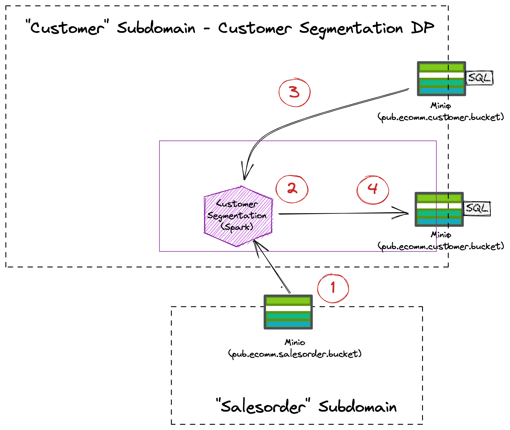

# Customer Subdomain - Customer Segmentation Data Product

## Exposed Ports
 
 * Object Storage
   * `pub.ecomm.customer.bucket`  

## Implementation

The following diagram shows the internal working of the Customer Domain with the Customer Data Product:

