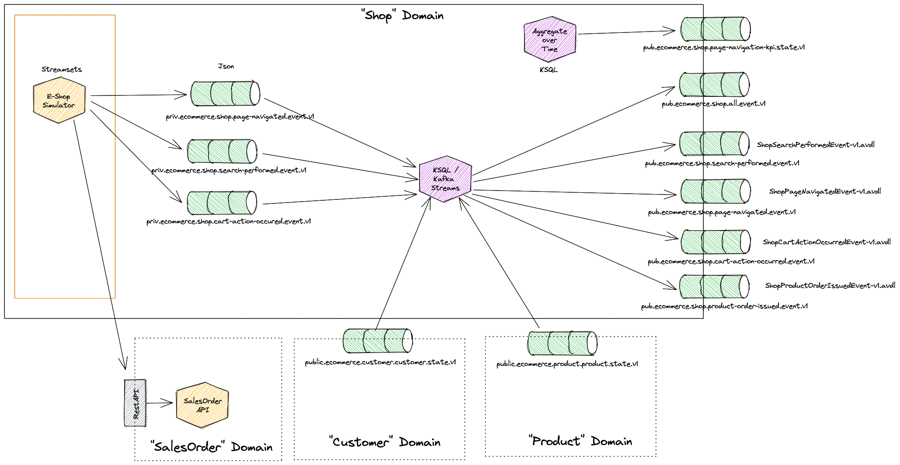
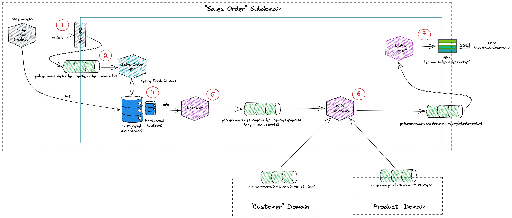
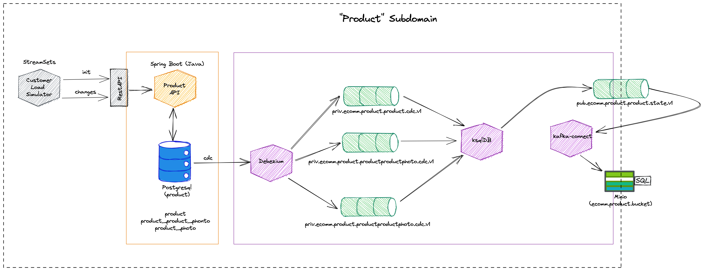
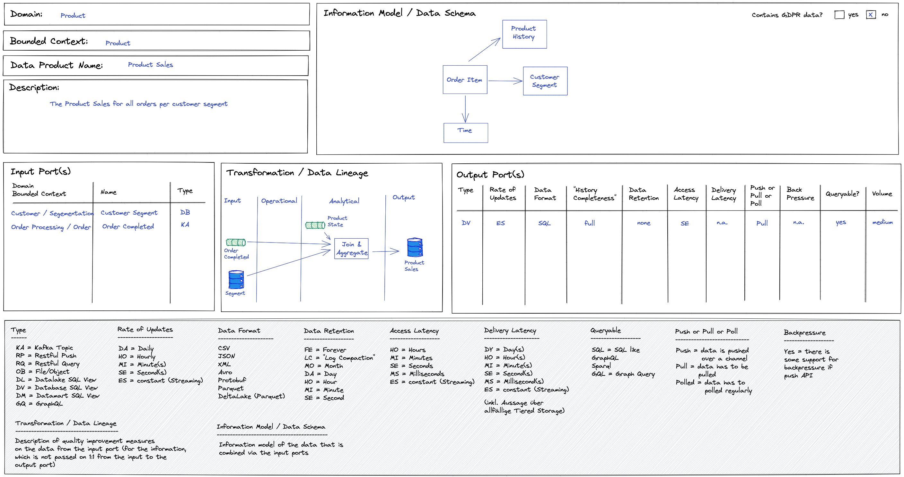
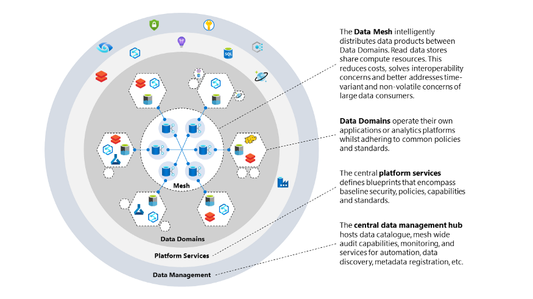
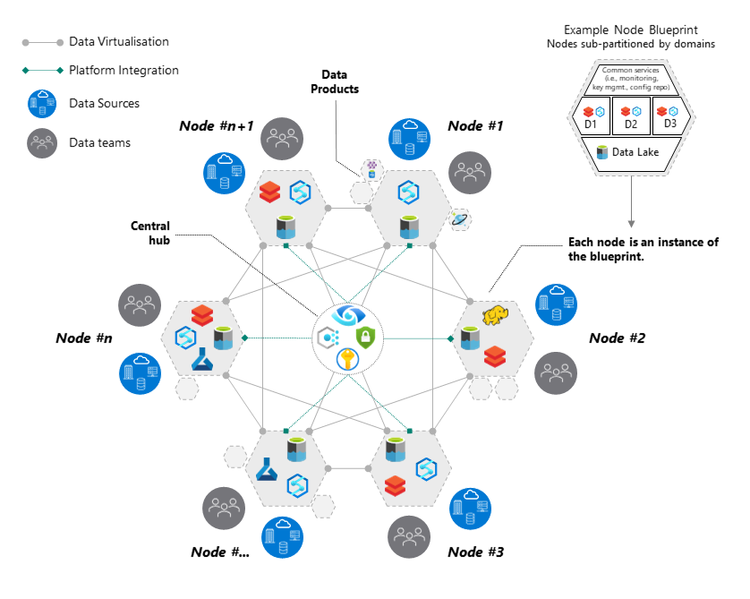
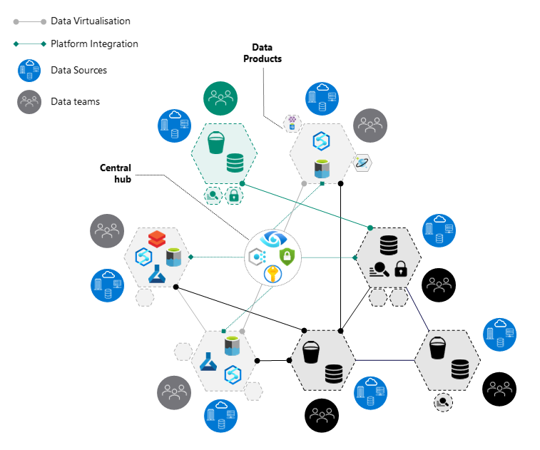

# Enterprise Data MESH journey :airplane: *from Theory to Practice*

- This repository is my [*@DeepHiveMind*](https://DeepHiveMind.io) humble contribution to the Open Source Community for **The Best of Enterprise Data Mesh 2.0** by introducing the Constructs, Design Elements, Real life implementations of Data Mesh, Codesets, Data Mesh Reference Artefacts & FAQs from the captivating landscape of Distributed Data Mesh 2.0. 

- 💡 Many enterprises are investing in their next generation data hub, with the hope of democratizing data at scale to provide business insights and ultimately make automated intelligent decisions. Data platforms based on the data lake architecture have common failure modes that lead to unfulfilled promises at scale. To address these failure modes we need to shift from the *centralized paradigm of a lake, or its predecessor data warehouse*. 💡 We need to shift to a paradigm that draws from *modern distributed architecture: considering domains as the first class concern, applying platform thinking to create self-serve data infrastructure, and treating data as a product*. 💡 Data Mesh paradigm reduces overall friction for information flow in the organization, where the producer is responsible for the datasets they produce and is accountable to the consumer based on the advertised SLAs.

- To Move Beyond a Monolithic Data Lake/ Centralized LakeHouse / Data Warehouse to a Distributed Data Mesh paradigm is a JOURNEY. :airplane:

- Welcome onaboard to **The Universe of "Distributed Data Mesh 2.0!"**.
 
Disclamer:

	1. The paradigm shift in Distributed Data Architecture with domain driven ownership comes with several nuances and consideration. 
	Implmentation of Data Mesh architecture in any enterprise mostly depends on 
	(a) organizational maturity and skills, 
	(b) organizational structure, 
	(c) risk appetite, 
	(d) sizing and dynamics. 
	
	2. Data Mesh has a concrete set of principles (most importantly a set of ideas). Physcializing those ideas to practice by building out mesh is a JOURNEY.
	
	3. There may not be an obvious THRESHOLD to measure the Data Mesh industrialization. i.e., it's a continuum of care.
	
 

# Agenda
- Nuances of The Universe of "Ditributed Data Mesh 2.0" 
 
			>> 1. What is the Business Goal of Enterprise Data MESH? | 
			>> 2. Why Data MESH paradigm? | 		
			>> 3. Enterprise Data MESH Architecture Principles |  
			>> 4. Data Mesh Domain-Driven Pattern |  
			>> 5. Data Mesh Technology Patterns |   
			>> 6. DATA Mesh TOPOLOGY Patterns (Topology for decentralized distributed domain-driven data-product nodes) in Distributed Data Mesh 2.0|
			>> 7. Self-serve Data Platform Infrastructure |	
			>> 8. User Persona of Enterprise Data Mesh  |	
			>> 9. Data Mesh Reference Artefacts in Public Domain |
	

- DataMesh-as-a-Code on Cloud 
 
		>>>> A. DataMesh-as-a-Code on Azure Cloud |  
		>>>> B. DataMesh-in-practice on AWS Cloud |  
		>>>> C. DataMesh-as-a-Code on Open Source Technology (FOSS) |  
		>>>> D. DataMesh-in-Practice with DataBricks |   
		>>>> E. DataMesh-in-practice with Confluent Kafka |

 
 

## What is Enterprise Data MESH?
- "A Data Mesh is a paradigm shift in how we think about building data platforms. The architecture is the convergence of Distributed Domain Driven Architecture, Self-serve Platform Design and Product Thinking with Data". 
-- Zhamak Dehghani, Thoughtworks

- Data Mesh is a new/modern Data Platform paradigm to *DOMAIN-ORIENTED + DATA-PRODUCT + SELF-SERVE DATA Infra Platform + DECENTRALIZED TOPOLOGY* driven modern distributed data architecture that conforms to [A] the certain defined Architecture Principles (as detailed in below section) and [B] the tenets, such as:  
	(i) Considering domains as the first class concern,  
	(ii) Applying platform thinking to create self-serve data infrastructure, and  
	(iii) Treating data as a product

#### The Domain Goal of DATA MESH

- **A cloud distributed data mesh, which allows DOMAIN-SPECIFIC data and treats “DATA-as-a-PRODUCT”**. 
- :bulb: **Enabling each domain to handle its own DATA-PIPELINES**. This is different from plumbing data from the traditional (monolithic) platforms that generally tightly couple and often slow down the ingestion, storage, transformation, and consumption of data from one central data lake or hub.
- :bulb: Therefore, Data Mesh paradigm objective is to reduce overall friction for information flow in the organization, where the **data producer is responsible for the datasets they produce and is accountable to the consumer based on the advertised SLAs**.
- **Move away from tightly coupled data interfaces and varying data flows towards an architecture that allows eco-system connectivity**.

###### To be an integral part of Data Mesh OSS Community, Please make sure to go through the original paper on **[Data Mesh as defined by Martin Fowler](https://martinfowler.com/articles/data-mesh-principles.html)** 
 

## Why DATA MESH Architecture/Model/Paradigm?
Why to move from 'Central Data Platform' Architectue to Data Mesh Paradigm (Decentralized Domain Oriented Data Product, powered by Topologies for Decentralized Data-Product Node governance with Self-serve Data Infra)?

- The Beauty of 'Central Data Platform': Organizations of all sizes have recognized that data is one of the key enablers to increase and sustain innovation, and drive value for their customers and business units. They are eagerly modernizing traditional data platforms with cloud-native technologies that are highly scalable, feature-rich, and cost-effective.A centralized model is intended to simplify staffing and training by centralizing data and technical expertise in a single place, to reduce technical debt by managing a single data platform, and to reduce operational costs.
- The Challenge with 'Central Data Platform': Managing data through a Central Data Platform can create scaling, ownership, and accountability challenges, because central teams may not understand the specific needs of a data domain, whether due to data types and storage, security, data catalog requirements, or specific technologies needed for data processing.
- 'Data Mesh as Solution': These challenges can often be reduced by giving ownership and autonomy to the team who owns the data, best allowing them to build data products, rather than only being able to use a common central data platform. 
--------- :bulb: For instance, product teams (in E-Commerce/ e-shop) are responsible for ensuring the product inventory is updated regularly with new products and changes to existing ones. They’re the domain experts of the product inventory datasets. If a discrepancy occurs, they’re the only group who knows how to fix it. :bulb: Therefore, they’re best candidates to implement and operate a technical solution to ingest, process, and produce the product inventory dataset. Data Mesh paradigm and Architecture enables the domain team to perform these activities. 
--------- :bulb: With the Data Mesh, The E-Commerce/e-shop 'product team' owns everything leading up to the data being consumed: they choose the technology stack, operate in the mindset of data as a product, enforce security and auditing, and provide a mechanism to expose the data to the organization in an easy-to-consume way. 
--------- :bulb: Therefore, Data Mesh paradigm reduces overall friction for information flow in the organization, where the **data producer is responsible for the datasets they produce and is accountable to the consumer based on the advertised SLAs**.
 
 

## Architecture Principles of Enterprise Data MESH

**[Data Mesh as defined by Martin Fowler](https://martinfowler.com/articles/data-mesh-principles.html)** is a new paradigm to DOMAIN-ORIENTED + DATA PRODUCT + SELF-SERVE DATA Infra + DECENTRALIZED TOPOLOGY data architecture that conforms to the following main Architecture Principles, such as: 

	1. Domain Oriented DECENTRALIZATION
		a. Domain-oriented Data compute  
		b. Domain-oriented Data Stoarge  
		c. Domain-oriented Data pipeline
		d. Domain-oriented Data Model 

	2. Data-as-a-Product
		# DATA PRODUCT is a function of Data platform governed by MICROSERVICE GOVERNANCE & SERVICE MESH for self-discoverable, resilient, secured and performant for data domain services
	
		# Caveat: DATA PRODUCT & SERVICES are not defined by the size of the function, but instead by the context, cohesion and coupling, requiring either orchestration (Service) or choreography (Micro-Service) to mediate between Services  
	
	3. Self-serve Infra for data platform (DataInfra-as-a-Service)

	4. Centeralized Data Governance  
		a. Centralized Data Provenance (Domain Data Data catalogue, Data Protection and PII Anonymization, Data Lienage, Enterprise MDM 360, et al)  
		b. Unified Policy Management  
		c. Unified Data Virtualization Service  
		d. Federated Data Access Control Service  
		e. Organization wide Secured Data Sharing

	5. DATA MESH Topology (DECENTRALIZED Topology to power DataMesh NODE PATTERN)
		a. Governed Data Mesh topology  
		b. Harmonized Data Mesh topology  
		c. Highly federated Data Mesh topology
 
 

## Data Mesh Domain-Driven Patterns

Domain-driven Pattern simulation of Data Mesh are as following for E-Commerce/e-shop (Overall Biz Domain: ECommerce) with -

	1. Domain : Product
		a. Bounded Context : Product  
		b. Data Product Name : Product Sales  

	2. Domain : Product Recommendation
		a. Bounded Context : Production Recommendation  
		b. Data Product Name : Recommendation  

	3. Domain : Customer
		a. Bounded Context : Customer  
		b. Data Product Name : Customer Data  

	4. Domain : Customer
		a. Bounded Context : Customer  
		b. Data Product Name : Customer Segmentation  

	5. Domain : Customer
		a. Bounded Context : Customer  
		b. Data Product Name : Customer Interactions  

	6. Domain : Churn
		a. Bounded Context : Churn Detection
		b. Data Product Name : Churn Detection 

	7. Domain : E-Shop
		a. Bounded Context : E-Shop 
		b. Data Product Name : Shopping cart 

	8. Domain : E-Shop
		a. Bounded Context : E-Shop 
		b. Data Product Name : Page Navigation 

	9. Domain : E-Shop
		a. Bounded Context : E-Shop 
		b. Data Product Name : User Information 

	5. Domain : Order Processing
		a. Bounded Context : Order Processing  
		b. Data Product Name : OrderProcessingUpdate  

	... more..

 

|**Data MESH Domain-Driven PATTERN**| **Data MESH Domain-Driven PATTERN**| **Data MESH Domain-Driven PATTERN**|
| :---: | :---:| :---:|
| E-Commerce Overview showcase | SHOP-SalesORDER-CUSTOMER-PRODUCT Domain-Implmentation |  SALES ORDER Sub-domain| 
||||
|**Data MESH Domain-Driven PATTERN**| **Data MESH Domain-Driven PATTERN**| **Data MESH Domain-Driven PATTERN**| 
|  Product Sub-domain| product-sales-dataProduct| product-recommendation-dataProduct |
||||
|  Customer Sub-domain| customer-interactions-dataProduct| customer-segementation-dataProduct |
||||

 
 

## Data Mesh Techno-functional Patterns

Illustration of key Techno-functional Patterns of Data Mesh are as following- 

- Data Product Catalog
- Data Mesh & Event Streaming backbone
- Data Mesh & Data Lienage
- Data Mesh & AI ML
- Data Mesh & CDC
- Data Mesh & Real time Data Synch

|**Data MESH PATTERN**| **Data MESH PATTERN**| **Data MESH PATTERN**|
| :---: | :---:| :---:|
| Pattern_Data Mesh & Data Product Catalog | Pattern_Data Mesh & Event Streaming backbone |  Pattern_Data Mesh & Data Lienage| 
||||
|**Data MESH PATTERN**| **Data MESH PATTERN**| **Data MESH PATTERN**| 
| Pattern_Data Mesh & AI ML | Pattern_Data Mesh & CDC |  Pattern_Data Mesh & Real time Data Synch| 
||| |

 
 

## Data MESH TOPOLOGY Patterns

#### 3 Major DECENTRALIZED Topology Patterns are based on (a) Data Mesh Node Pattern and (b) Data Monetization feasibility -
- Governed Data Mesh topology
- Harmonized Data Mesh topology
- Highly federated Mesh topology
Based on nuances and considerations, different data mesh topologies can be used.

|**DATA MESH TOPOLOGY**| **DATA MESH TOPOLOGY**|
| :---: | :---:|
| Governed Data Mesh topology- DataMesh Node Pattern | Governed Data Mesh topology- DataMesh Node Ecosystem| 
|||
| **Harmonized Data Mesh topology** | **Highly federated Mesh topology**| 
|||

Please refer to [Data Mesh Topology](https://github.com/DeepHiveMind/Distributed_DataMesh_2.0_Cloud_Implementation/blob/main/DataMeshTopology.md) for further details into 3 most prevalent Topolgy patterns in Data Mesh.
 
 

## Self-serve Data Platform Infrastructure

The Self-serve Data Platform Infrastructure consists of two  major parts
 1. The *Core* Data Platform with all the technologies for building the **DATA PRODUCTS**
 2. The *Governance* Data Platform which hosts the **Governance related services for maniging the data products** 
 
 

## Enterprise Data Mesh Data-Product User Persona 
- Data Product Owners
	- - Citizen Developers (assisted by LCNC)
- Data Management & Governance 'Stewards'
- Semantic Specialists
- Data Story Tellers & Navigation SME
- Data Infra PlatformOps specialists
- Data Security Professionals
- CDO
 
 

## DataMesh-as-a-Code on Cloud

- [Distributed-Data-Mesh-as-a-Code on Cloud]
	
	- [DataMesh-as-a-Code on Azure Cloud](#DataMesh-as-a-Code-on-Azure-Cloud)	
	
	- [DataMesh-as-a-Code on AWS Cloud](#DataMesh-as-a-Code-on-AWS-Cloud)
	
	- [DataMesh-as-a-Code with Open Source Technology (FOSS)](#DataMesh-as-a-Code_with_FOSS)

	- [DataMesh-in-practice with DATABRICKS](https://databricks.com/session_na20/data-mesh-in-practice-how-europes-leading-online-platform-for-fashion-goes-beyond-the-data-lake)

> DataMesh-as-a-Code on Azure Cloud sample implementation  

	- Technology & Tools 

		-- Azure Purview	[Data Provenance engine]
		-- Azure Synapse Analytics	[Node on Domain driven storage- Azure MPP DWH]
		-- Azure CosmosDB			[Node on Domain driven storage- MultiDomain NOSQL DB ]
		-- Azure Data Lake			[Node on Domain driven storage- Data Lake Storage]
		-- Azure Stream Analytics	[Stream Analytics engine]
		-- Azure Data Explorer		[Data Exploration Service]
		-- Presidio					[ Data Protection and PII Anonymization API]
		
		-- Azure Data Factory [Data Ingestion engine]
		-- Azure DataBricks [Data Integration engine]

		-- Azure Function & Azure App Logic [MicroService Serverless engine & MicroService Serverless Orachsteration engine]
		
		-- IaC ARM Templates				[IaC engine]
		-- Azure Vnet & SubNet		[Azure Networking]
		-- Azure DevOps 			[DevOps Service]
		-- Azure Key Valut			[Key Security]
		-- Azure App Insight 	[Azure Application Monitoring & Telemetry Service engine]
		-- Modern Domain Driven Data Warehouse on DataOps
		
	- Yet to be implemented Tools & Technology
		-- Domain Ontology on CosmosDB			[Knowledge Graph]		
		-- WebOntology & Protege
		-- Azure AKS for Data Domain KnowledgeGraph			[Azure Managed K8S Services for managing ontology services]
		-- Istio on AKS 				[Service Mesh for Service Independence, Dynamic Service discovery, circuit breaking, mTLS b/w service-to-service communication] 
		

## Data Mesh Reference Artefacts in Public Domain 

	- [Reference Technical Blogs](#Reference-Technical-Blogs)
	- [Reference Training Courses](#Reference-training-courses)
	- [Reference Books](#Reference-Books)
	- [Community Resources](#community-resources)
	- [Conferences](#conferences)
	
Please refer to the [Curated list of Data MESH Artefacts for reference](README_DataMesh_Reference_Artefacts_CuratedList.md)

## License
I, [*DeepHiveMind*](https://DeepHiveMind.io), am providing resources in this repository to you under custom Copyright & license (Copyright 2019 DeepHiveMind & Creative Commons Legal Code CC0 1.0 Universal). Please Refer to the [Copyright 2019 DeepHiveMind License](https://github.com/DeepHiveMind/gateway_to_DeepReinforcementLearning_DeepNN/blob/master/LICENSE) for further details as to this. Thanks!

However, to the extent possible under law, [DeepHiveMind](https://DeepHiveMind.io) has waived all copyright and related or neighboring rights to the codesets.
