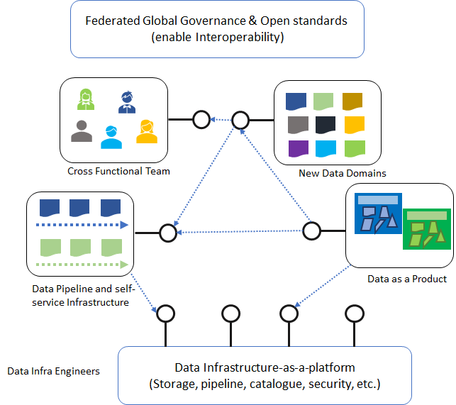
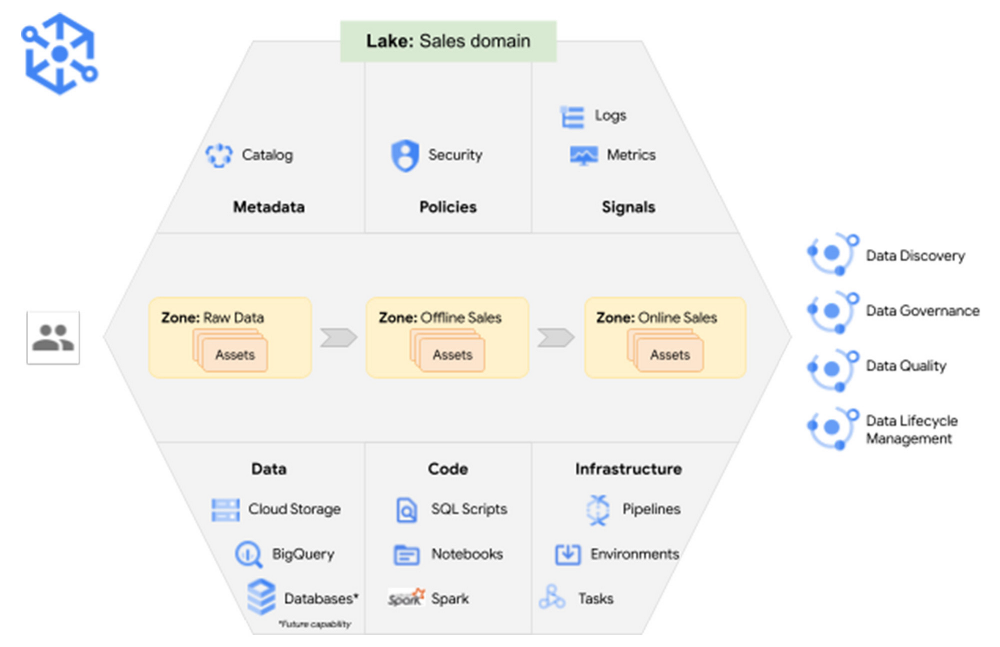

# Enterprise Data MESH journey :airplane: *from Theory to Practice*

- This repository is my [*@DeepHiveMind*](https://DeepHiveMind.io) humble contribution to the Open Source Community for **The Best of Enterprise Data Mesh** by introducing the Constructs, Design Elements, Real life implementations, Codesets, Reference Artefacts, FAQs & more from the captivating landscape of Distributed Data Mesh 2.0. 

- 💡 Many enterprises are investing in their next generation data hub, with the hope of democratizing data at scale to provide business insights and ultimately make automated intelligent decisions. Data platforms based on the data lake architecture have common failure modes that lead to unfulfilled promises at scale. To address these failure modes we need to shift from the *centralized paradigm of a lake, or its predecessor data warehouse*. 💡 We need to shift to a paradigm that draws from *modern distributed architecture: considering domains as the first class concern, applying platform thinking to create self-serve data infrastructure, and treating data as a product*. 💡 Data Mesh paradigm reduces overall friction for information flow in the organization, where the producer is responsible for the datasets they produce and is accountable to the consumer based on the advertised SLAs.

- To Move Beyond a Monolithic Data Lake/ Centralized LakeHouse / Data Warehouse to a Distributed Data Mesh paradigm is a JOURNEY. :airplane:

- Welcome onaboard to **The Universe of "Distributed Data Mesh 2.0!"**.

 
 

# Agenda

The Repo welcomes members of Data Mesh OSS Community (Open Source Community) with 2 major sections/segments - 
 
*'The 1st segment' is more of a conceptual artefacts (all bundeled under "Conceptual nuances of The Universe of Ditributed Data Mesh 2.0" section). This segment intends to offer all the major bells-and-whistles to get a broader vision, mission and understanding of Enterprise Data MESH framework.*

*'The 2nd segment' is dedicated for DOERS who believe in industrialization of framework in real world (all bundeled in "DataMesh-as-a-Code on Cloud for Industrialization" section). This segment intends to share keys aspects of codesets (please note, it's the key aspects of the complete codesets) in order to Industrialize Enterprise Data MESH framework.*

- :eight_pointed_black_star: [THE SEGMENT 1 for poets] - **Conceptual Universe of 'Ditributed Data Mesh 2.0'** 

	- |1| [What is Enterprise Data MESH](https://github.com/DeepHiveMind/Distributed_DataMesh_2.0_Cloud_Implementation#what-is-enterprise-data-mesh) |
	- |2| [Domain-driven GOAL of Data Mesh](https://github.com/DeepHiveMind/Distributed_DataMesh_2.0_Cloud_Implementation#the-domain-driven-goal-of-data-mesh) |
	- |3| [Why Data MESH paradigm / Drivers of Data MESH](https://github.com/DeepHiveMind/Distributed_DataMesh_2.0_Cloud_Implementation#why-data-mesh-architecturemodelparadigm) |
	- |4| [Data MESH - Principles](https://github.com/DeepHiveMind/Distributed_DataMesh_2.0_Cloud_Implementation#principles-of-enterprise-data-mesh) | 
	- |5| [Data Mesh - Reference Design]() | 
	- |6| [Data Mesh - Architectural Patterns](https://github.com/DeepHiveMind/Distributed_DataMesh_2.0_Cloud_Implementation/blob/main/README.md#data-mesh-techno-functional-architectural-patterns) |   
	- |7| [DATA Mesh - TOPOLOGY Patterns](https://github.com/DeepHiveMind/Distributed_DataMesh_2.0_Cloud_Implementation#data-mesh-topology-patterns) |
	- |8| [Self-serve Data Platform Infrastructure](https://github.com/DeepHiveMind/Distributed_DataMesh_2.0_Cloud_Implementation#self-serve-data-platform-infrastructure) |	
	- |9| [User Persona of Enterprise Data Mesh](https://github.com/DeepHiveMind/Distributed_DataMesh_2.0_Cloud_Implementation#enterprise-data-mesh-data-product-user-persona)  |
	- |10| [The Challenges of Data Mesh](https://github.com/DeepHiveMind/Distributed_DataMesh_2.0_Cloud_Implementation/blob/main/README.md#the-challenges-of-data-mesh)  |
	- |11| [Data Fabric vs Data Mesh](https://github.com/DeepHiveMind/Distributed_DataMesh_2.0_Cloud_Implementation/blob/main/README.md#data-fabric-vs-data-mesh)  |	
	- |12| [curated list of Data Mesh Reference Artefacts in Public Domain](https://github.com/DeepHiveMind/Distributed_DataMesh_2.0_Cloud_Implementation/blob/main/README_DataMesh_Reference_Artefacts_CuratedList.md) |
	

- :eight_pointed_black_star: [THE SEGMENT 2 for doers] -  **DataMesh-as-a-Code on Cloud for Industrialization** 	
	- |13| [DATAMESH-AS-A-CODE on AZURE](#DataMesh-as-a-Code-on-AZURE)
		- AZURE cloud-native Data Mesh Reference Architecture
		- AZURE cloud-native Technology & Tools
		- AZURE DataMesh Industrialization Codeset
	- |14| [DATAMESH-AS-A-CODE on OSS](#DataMesh-as-a-Code-on-OSS)
		- OSS Data Mesh Reference Architecture
		- OSS cloud-native Technology & Tools
		- OSS DataMesh Industrialization Codeset
	- |15| [DataMesh-as-a-Code on AWS](#DataMesh-as-a-Code-on-AWS)
		- AWS cloud-native Data Mesh Reference Architecture
		- AWS cloud-native Technology & Tools
		- AWS DataMesh Industrialization Codeset
	- |16| [DataMesh-as-a-Code on GCP](#DataMesh-as-a-Code-on-GCP)
		- GCP cloud-native Data Mesh Reference Architecture
		- GCP cloud-native Technology & Tools
		- GCP DataMesh Industrialization Codeset		
	- |17| [DataMesh-as-a-Code on DATABRICKS](#DataMesh-as-a-Code-on-DATABRICKS)
	- |18| [DataMesh-as-a-Code on CONFLUENT](#DataMesh-as-a-Code-on-CONFLUENT)
	
	
Please refer to different sub-folders in this repository to access the codesets. The codesets reflects Industrialization of Data Mesh on Azure/AWS Cloud using Cloud-native IaaS/PaaS/FaaS, Free & Open Source Technologies etc.

**Disclaimer**:
In case, [a] *you're willing to contribute to the FOSS Community for Data MESH*, or, [b] *require full access to the code-set for Academic/Not-for-profit purposes*, Please reach me @[DeepHiveMind Contact](https://deephivemind.io/contact.html). I may grant you the full access to my another private repo with the full code sets (in due conformance with "Copyright 2019 DeepHiveMind License").
 
 
 
 

## What is Enterprise Data MESH?

- "A Data Mesh is a paradigm shift in how we think about building data platforms. 
The architecture is the convergence of Distributed Domain Driven Architecture, Self-serve Platform Design and Product Thinking with Data". 
-- Zhamak Dehghani, Thoughtworks

- Data Mesh is a new/modern Data Platform paradigm to *DOMAIN-ORIENTED + DATA-PRODUCT + SELF-SERVE DATA Infra PLATFORM + FEDERATED GOVERNANCE + DECENTRALIZED TOPOLOGY* driven modern distributed data architecture that conforms to
			[A] the certain defined [Architecture Principles as detailed in below section](#architecture-principles-of-enterprise-data-mesh) and
			[B] the tenets, such as:  
				(i) Considering Domains as the first class concern,  
				(ii) Applying Platform thinking to create Self-Serve Data Infrastructure, and  
				(iii) Treating Data as a Product with
				(iv) Federated Governance

- 'Distributed Data Mesh 2.0' is an advancement of Data Mesh Architectural paradigm with [advanced Data Mesh Topologies](#data-mesh-topology-patterns) across Multi/Hybrid Cloud.

 
Attention:

	1. The paradigm shift in Distributed Data Architecture with domain driven ownership comes with several nuances and consideration. 
	Implmentation of Data Mesh architecture in any enterprise mostly depends on 
	(a) organizational maturity and skills, 
	(b) organizational structure, 
	(c) risk appetite, 
	(d) sizing and dynamics. 
	
	2. Data Mesh has a concrete set of principles (most importantly a set of ideas). Physcializing those ideas to practice by building out mesh is a JOURNEY.
	
	3. There may not be an obvious THRESHOLD to measure the Data Mesh industrialization. i.e., it's a Continuum of Care (CoC).
	
	4. While Data Mesh allows much more room to flex and scale, as every other paradigm, shouldn’t be considered as a perfect-fit solution for every single scenario. As with all decentralised data architectures, there are a few common challenges. Please refer below to the sub-topic [The Challenges of Data Mesh] for further insight. 
	
 

#### The Domain-driven Goal of DATA MESH

- **A cloud distributed data mesh, which allows DOMAIN-SPECIFIC data and treats “DATA-as-a-PRODUCT”**. 
- :bulb: **Enabling each DOMAIN to handle its own DATA-PIPELINES**. This is different from plumbing data from the traditional (monolithic) platforms that generally tightly couple and often slow down the ingestion, storage, transformation, and consumption of data from one central data lake or hub.
- :bulb: Therefore, Data Mesh paradigm objective is to reduce overall friction for information flow in the organization, where the **data producer is responsible for the datasets they produce and is accountable to the consumer based on the advertised SLAs**.
- **Move away from tightly coupled data interfaces and varying data flows towards an architecture that allows eco-system connectivity**.

###### To be an integral part of Data Mesh OSS Community, Please be conversant with **[Data Mesh as defined by Martin Fowler](https://martinfowler.com/articles/data-mesh-principles.html)** 

 | | | | | |

 

## Why DATA MESH Architecture/Model/Paradigm?
#### DRIVERS OF DATA MESH

:bulb: Let us explore Why to move away from 'CENTERAL DATA PLATFORM' Architectue to 'DATA MESH Paradigm based DATA PLATFORM' (Decentralized Domain Oriented Data Product, powered by Topologies for Decentralized Data-Product Node governance with Self-serve Data Infra)? 

		Answer of the aforementioned Question lies is in 3 STEP PROCESS - 
			- STEP 1: Let's first acknowledge {The Beauty of 'Central Data Platform'}
			- STEP 2: Let's then explore { The Challenge/ Bottleneck with 'Central Data Platform' }
			- STEP 3: Let's then find out solution in { 'Data Mesh as Solution'}

- STEP 1: *The Beauty of 'Central Data Platform'*:
 
Organizations of all sizes have recognized that data is one of the key enablers to increase and sustain innovation, and drive value for their customers and business units. They are eagerly modernizing traditional data platforms with cloud-native technologies that are highly scalable, feature-rich, and cost-effective. A centralized model is intended to
		[a] simplify staffing and training by centralizing data and technical expertise in a single place, 
		[b] to reduce technical debt by managing a single data platform, and
		[c] to reduce operational costs.

- STEP 2: *The Challenge/ Bottleneck with 'Central Data Platform'*: 

Managing data through a Central Data Platform can create following multi-dimensional challenges, (as central teams may not understand the specific needs of a data domain, whether due to data types and storage, security, data catalog requirements, or specific technologies needed for data processing.) --

		 [a] scaling, 
		 [b] ownership,
		 [c] accountability challenges,
		 [d] Huge backlog - 
		 'Central Data platform' pattern works for smaller organizations and organizations that have a high degree of centralization from a team setup perspective. However, using only a single team often creates a bottleneck in larger organizations. This bottleneck causes a huge backlog, with parts of an organization having to wait for data integration services and Analytical solutions. 
		 [e] Organizations adopting MODERN DATA SCIENCE solutions -
		Many modern data science solutions require more data than traditional business intelligence solutions did in the past. It creates a huge backlog and depedencies on central Data platform team. 
		 [f] Organizations are DECENTRALIZED and DISTRIBUTED from a business perspective - 
		Most organizations are decentralized and distributed from a business perspective. Having a single team handling all of data ingestion on a single platform in a large organization can also be problematic. One team rarely has experts for every data source.
		 [g] Microservices as an Application development pattern for Business Transcation Processing Source System -- 
		The recent switch to using microservices as an application development pattern is another driver of long backlogs around data integration because it increases the number of data sources.

- STEP 3: *'Data Mesh as Solution'*:
 
These challenges can often be reduced by **giving ownership and autonomy to the team who owns the data, best allowing them to build data products, rather than only being able to use a common central data platform**. 
Data Mesh paradigm is the solution as it supports all the constructs to make it work. As

:bulb: For instance, product teams (in E-Commerce/ e-shop) are responsible for ensuring the product inventory is updated regularly with new products and changes to existing ones. They’re the domain experts of the product inventory datasets. If a discrepancy occurs, they’re the only group who knows how to fix it. :bulb: Therefore, they’re best candidates to implement and operate a technical solution to ingest, process, and produce the product inventory dataset. Data Mesh paradigm and Architecture enables the domain team to perform and own these activities.

:bulb: With the Data Mesh, The E-Commerce/e-shop 'product team' owns everything leading up to the data being consumed: they choose the technology stack, operate in the mindset of data as a product, enforce security and auditing, and provide a mechanism to expose the data to the organization in an easy-to-consume way.

:bulb: Data MESH paradigm is based on Architectural framework which infuses Microservices as an application development pattern for the MODERN DISTRIBUTED DECNETRALIZED DATA PLATFORM. 

:bulb: Therefore, Data Mesh paradigm reduces overall friction for information flow in the organization, where the **data producer is responsible for the datasets they produce and is accountable to the consumer based on the advertised SLAs**.
 
 

## Principles of Enterprise Data MESH

**[Data Mesh as defined by Martin Fowler](https://martinfowler.com/articles/data-mesh-principles.html)** is a new paradigm to DOMAIN-ORIENTED + DATA PRODUCT + SELF-SERVE DATA Infra + DECENTRALIZED TOPOLOGY data architecture that conforms to the following main Architecture Principles, such as: 

	1. Domain Oriented DECENTRALIZATION
		a. Domain-oriented Data compute  
		b. Domain-oriented Data Stoarge  
		c. Domain-oriented Data pipeline
		d. Domain-oriented Data Model 

	2. Data-as-a-Product
		# DATA PRODUCT is a function of Data platform governed by MICROSERVICE GOVERNANCE & SERVICE MESH for self-discoverable, resilient, secured and performant for data domain services
	
		# Caveat: DATA PRODUCT & SERVICES are not defined by the size of the function, but instead by the context, cohesion and coupling, requiring either orchestration (Service) or choreography (Micro-Service) to mediate between Services  
	
	3. Self-serve Infra for data platform (DataInfra-as-a-Service)

	4. Centeralized Data Governance (Federated Computational Governance)
		a. Centralized Data Provenance (Domain Data Data catalogue, Data Protection and PII Anonymization, Data Lienage, Enterprise MDM 360, et al)  
		b. Unified Policy Management  
		c. Unified Data Virtualization Service  
		d. Federated Data Access Control Service  
		e. Organization wide Secured Data Sharing

	5. DATA MESH Topology (DECENTRALIZED Topology to power DataMesh NODE PATTERN)
		a. Governed Data Mesh topology  
		b. Harmonized Data Mesh topology  
		c. Highly federated Data Mesh topology

		
 | | |

		Based on the aforementioned tenets of Data Mesh, it's safe to call out that, 
			:1: "Data Mesh is a MESH OF DATA PRODUCT NODES". 
			:2: pretty much alike "Service MESH of Microservices powered Data Products".
	

 
 

## Data Mesh Domain-Driven Patterns

Domain-driven architecture Pattern simulation of Data Mesh are as following for "E-Commerce/e-shop (Overall Biz Domain: ECommerce)" with -

	1. Domain : Product
		a. Bounded Context : Product  
		b. Data Product Name : Product Sales  

	2. Domain : Product Recommendation
		a. Bounded Context : Production Recommendation  
		b. Data Product Name : Recommendation  

	3. Domain : Customer
		a. Bounded Context : Customer  
		b. Data Product Name : Customer Data  

	4. Domain : Customer
		a. Bounded Context : Customer  
		b. Data Product Name : Customer Segmentation  

	5. Domain : Customer
		a. Bounded Context : Customer  
		b. Data Product Name : Customer Interactions  

	6. Domain : Churn
		a. Bounded Context : Churn Detection
		b. Data Product Name : Churn Detection 

	7. Domain : E-Shop
		a. Bounded Context : E-Shop 
		b. Data Product Name : Shopping cart 

	8. Domain : E-Shop
		a. Bounded Context : E-Shop 
		b. Data Product Name : Page Navigation 

	9. Domain : E-Shop
		a. Bounded Context : E-Shop 
		b. Data Product Name : User Information 

	5. Domain : Order Processing
		a. Bounded Context : Order Processing  
		b. Data Product Name : OrderProcessingUpdate  

	... more..

 

|**Data MESH Domain-Driven PATTERN**| **Data MESH Domain-Driven PATTERN**| **Data MESH Domain-Driven PATTERN**|
| :---: | :---:| :---:|
| E-Commerce Overview showcase | SHOP-SalesORDER-CUSTOMER-PRODUCT Domain-Implmentation |  SALES ORDER Sub-domain| 
||||
|**Data MESH Domain-Driven PATTERN**| **Data MESH Domain-Driven PATTERN**| **Data MESH Domain-Driven PATTERN**| 
|  Product Sub-domain| product-sales-dataProduct| product-recommendation-dataProduct |
||||
|  Customer Sub-domain| customer-interactions-dataProduct| customer-segementation-dataProduct |
||||

 
 

## Data Mesh Architectural Patterns

Illustration of key Techno-functional Architectural Patterns of Data Mesh are as following- 

- Enterprise Data Mesh Architecture
- Data Mesh & Data Product Architecture
- Data Mesh & Data Product Catalog
- Data Mesh & Event Streaming backbone
- Data Mesh & Data Lienage
- Data Mesh & AI ML
- Data Mesh & CDC
- Data Mesh & Real time Data Synch

|**Data MESH ARCHITECTURE PATTERN**| **Data MESH ARCHITECTURE PATTERN**| **Data MESH ARCHITECTURE PATTERN**|
| :---: | :---:| :---:|
| Enterprise Data Mesh Architecture | Enterprise Data Mesh Architecture  |  Enterprise Data Mesh & Data Product Architecture  | 
||||
| Pattern_Data Mesh & Data Product Catalog | Pattern_Data Mesh & Event Streaming backbone |  Pattern_Data Mesh & Data Lienage| 
||||
| Pattern_Data Mesh & AI ML | Pattern_Data Mesh & CDC |  Pattern_Data Mesh & Real time Data Synch| 
||| |

 
 

## Data MESH TOPOLOGY Patterns
Topology is the key driver for decentralized distributed domain-driven data-product nodes in Distributed Data Mesh 2.0.

#### 3 Major DECENTRALIZED Topology Patterns are based on (a) Data Mesh Node Pattern and (b) Data Monetization feasibility -
- Governed Data Mesh topology
- Harmonized Data Mesh topology
- Highly federated Mesh topology

|**DATA MESH TOPOLOGY**| **DATA MESH TOPOLOGY**|
| :---: | :---:|
| Governed Data Mesh topology- DataMesh Node Pattern | Governed Data Mesh topology- DataMesh Node Ecosystem| 
|||
| **Harmonized Data Mesh topology** | **Highly federated Mesh topology**| 
|||

- Governed Mesh Topology: 
	- The first pattern is the “governed mesh topology”. In this model, as it's evident from the image above, the different data domains are grouped and represented as nodes. Each node can be seen as a domain, which can represent itself as either a data provider and/or data consumer towards the other domains.
	- The central heart in the architecture represents all data governance and management solutions for staying in control. It hosts a data catalogue, policy and security enforcement, mesh wide audit capabilities, monitoring, and auxiliary services for deployment and automation.
	- The benefit of the governed mesh approach is that it better addresses the time-variant and non-volatile concerns for large data consumers. So, it supports can domain time-travel and data deliveries are managed via time periods, which are centrally orchestrated. At the same time, you can block any data distribution in case of data quality problems, for example when cross identifiers between domains don’t match. Another benefit is that you more efficiently can share (central) compute resources.
	
- Harmonized Mesh Topology:
	- The second pattern is the harmonized mesh topology, a term that first has been coined by John Mallinder. In this model nodes operate more on their own. Data distribution goes point-to-point but is governed at the same time.
	- The benefit of this model is higher flexibility and autonomy for the different domains. The drawback of the model is more network traffic and less efficient utilization of resources, since the entire model is federated. It also requires more mature teams and excellent self-serve (cloud) infrastructure to be up and running.
	
- Highly Federated Mesh Topology:
	- The key last approach is called a highly federated mesh approach. In this model there’s high autonomy for domains to implement their own stack of technologies in different environments. This results in greater flexibility for special domains, experiments or domains that require fast time to market.
	- In this model you could even pursue a mixed governance model: distribution via hubs, point-to-point or combination of these. Concretely, this means that the model is changed to give domains flexibility to choose, build, and run their own flavor of, for example, any database or integration platform. Domains in this federated approach are required to hook their solutions into the central governance capabilities themselves. The metadata (ownership, data product information, sharing agreement, etc.) is always managed centrally. 

Based on nuances and considerations, different data mesh topologies can be used.
- Governance TOPOLOGY: Different Approaches 

- Microsoft Ignite Reference on TOPOLOGY (Governed Data Mesh Topology) -  [A financial institution scenario for data mesh by Microsoft Ignite](https://learn.microsoft.com/en-us/azure/cloud-adoption-framework/scenarios/cloud-scale-analytics/architectures/reference-architecture-data-mesh)

Please refer to [Data Mesh Topology](https://github.com/DeepHiveMind/Distributed_DataMesh_2.0_Cloud_Implementation/blob/main/DataMeshTopology.md) for further details into 3 most prevalent Topolgy patterns in Data Mesh.
 
 

## Self-serve Data Platform Infrastructure

The Self-serve Data Platform Infrastructure consists of two  major parts
 1. "The *Core* Data Platform" with all the technologies for building the **DATA PRODUCTS**
 2. "The *Governance* Data Platform" which hosts the **Governance related services for maniging the data products** 
 
- Self-Serve Data-Platform-Infra:

 
 
 

## Enterprise Data Mesh Data-Product User Persona 
- CDO
- Data Product Owners
		
		& Citizen Data Product Developers (assisted by LCNC)
- Data Management & Governance 'Stewards'
- Semantic Specialists
- Data Story Tellers & Navigation SME
- Data Infra PlatformOps specialists
- Data Security Professionals

 
 

## The challenges of Data Mesh

While Data Mesh allows much more room to flex and scale, as every other paradigm, shouldn’t be considered as a perfect-fit solution for every single scenario. As with all decentralised data architectures, there are a few common challenges, including:

- Ensuring that toolsets and approaches are unified (where applicable) across teams.
- Harmonising data and unifying presentation. A user that reads interconnected data across several data products should be able to map it correctly.
- Making data products easy to find and understand, through a comprehensive documentation process.
- Establishing consistent monitoring, alerting and logging practices.
- Safeguarding data access controls, especially where a many-to-many relationship exists between data products.
- Minimise the duplication of workload and data between different teams; centralised data management is often incredibly hard to implement company-wide.

 
 

## Data Fabric vs Data Mesh

- A data fabric and a data mesh both provide an architecture to access data across multiple technologies and platforms, a data fabric is technology-centric, while a data mesh focuses on organisational change.

- Data fabric connects data from multiple sources and prepares it in a way in which you – a business user or a data professional – can access and analyse it easily. Think about it like putting a big blanket around your architecture to easily access what you need from the outside of the blanket. 
Whereas, the Data Mesh paradigm stands for decentralised and domain-specific data ownership that is easily discoverable and ready for consumption for everyone in the organisation via a Marketplace.

			According to *Gartner*, data fabric is a design concept that serves as an integrated layer (fabric) of data and connecting processes. It is a composable, flexible and scalable way to maximize the value of data in an organization. It’s not one tool or process, rather an emerging design concept that gives a framework to think about how to stack existing tools, resources, and processes.
		
- Data mesh moves away from the concept of storing, transforming, and processing analytical data centrally. Instead, it advocates that each business domain is responsible for hosting, preparing, and serving their data to their own domain and larger audience. 
 
 

## Distributed-DataMesh-as-a-Code on Cloud

Data Mesh Industrialization Codeset
 
		- DataMesh-as-a-Code-on-AZURE	
		- DataMesh-as-a-Code_with_FOSS
		- DataMesh-as-a-Code-on-AWS
		- DataMesh-as-a-Code-on-GCP
		- DataMesh-as-a-Code-on-DATABRICKS
		- DataMesh-as-a-Code-on-CONFLUENT

### DATAMESH-AS-A-CODE on AZURE 

##### AZURE cloud-native Data Mesh Reference Architecture 

 | | |

 | | |

	Azure DataMesh Nodes Infra_Option 1_Full VNET Peering
	Azure DataMesh Nodes Infra_Option 2_Hub and Spoke VNET
	Azure DataMesh Nodes Infra_Option 2_Peering Targeted Service Endpointes
	
 | | |

##### AZURE cloud-native Technology & Tools 

		-- Azure Purview			[Data Provenance engine]
		-- Azure Synapse Analytics	[Node on Domain driven storage- Azure MPP DWH]
		-- Azure CosmosDB			[Node on Domain driven storage- MultiDomain NOSQL DB ]
		-- Azure Data Lake			[Node on Domain driven storage- Data Lake Storage]
		-- Azure Stream Analytics	[Stream Analytics engine]
		-- Azure Data Explorer		[Data Exploration Service]
		-- Presidio					[Data Protection and PII Anonymization API]
		-- Azure Data Factory		[Data Ingestion engine]
		-- Azure DataBricks 		[Data Integration engine]
        
		-- Azure Function 			[MicroService Serverless engine]
		-- Azure App Logic			[MicroService Serverless Orachsteration engine]
		
		-- IaC ARM Templates		[IaC engine]
		-- Azure Vnet & SubNet		[Azure Virtual Network & Sub Network]
		-- Azure DevOps 			[DevOps Service]
		-- Azure Key Valut			[Key Security]
		-- Azure App Insight 		[Azure Application Monitoring & Telemetry Service engine]
		-- Private Endpoint			[Network interface connects you privately and securely to Azure service]
		-- Azure Private DNS		[Azure DNS not only supports internet-facing DNS domains, but it also supports private DNS zones.]
		-- Azure AKS for Data Domain KnowledgeGraph			[Azure Managed K8S Services for managing ontology services]
		-- Istio on AKS 				[Service Mesh for Service Independence, Dynamic Service discovery, circuit breaking, mTLS b/w service-to-service communication]	
		-- Azure DevOps					[Devops as one of the Modern DataOps drivers]		 
        
        -- Domain Ontology on CosmosDB			[Knowledge Graph]		
        -- WebOntology & Protege				[Knowledge Graph]

##### AZURE DataMesh Industrialization Codeset		

[Click to refer to AZURE DataMesh implementation CODESET folder](https://github.com/DeepHiveMind/Distributed_DataMesh_2.0_Cloud_Implementation/tree/main/01%20DataMesh-as-a-Code_AZURE)

		Disclaimer:
			In case, [a] *you're willing to contribute to the FOSS Community for Data MESH*, or, [b] *require full access to the code-set for Academic/Not-for-profit purposes*, Please reach me @[DeepHiveMind Contact](https://deephivemind.io/contact.html). I may grant you the full access to my another private repo with the full code sets (in due conformance with "Copyright 2019 DeepHiveMind License").
 

### DATAMESH-AS-A-CODE on AWS 
- AWS cloud-native Data Mesh Architecture 

| | | |
| |  |  |

- AWS DataMesh Sample implementation Codeset		

[Click to refer to AWS DataMesh implementation CODESET folder](https://github.com/DeepHiveMind/Distributed_DataMesh_2.0_Cloud_Implementation/tree/main/03%20DataMesh-as-a-Code_AWS)
		

		Disclaimer:
			In case, [a] *you're willing to contribute to the FOSS Community for Data MESH*, or, [b] *require full access to the code-set for Academic/Not-for-profit purposes*, Please reach me @[DeepHiveMind Contact](https://deephivemind.io/contact.html). I may grant you the full access to my another private repo with the full code sets (in due conformance with "Copyright 2019 DeepHiveMind License").
 

### DATAMESH-AS-A-CODE on GCP 
- GCP cloud-native Data Mesh Architecture 

 |  |  |

- GCP DataMesh Sample implementation Codeset		

[Click to refer to GCP DataMesh implementation CODESET folder](https://github.com/DeepHiveMind/Distributed_DataMesh_2.0_Cloud_Implementation/tree/main/04%20DataMesh-as-a-Code_GCP)
	

		Disclaimer:
			In case, [a] *you're willing to contribute to the FOSS Community for Data MESH*, or, [b] *require full access to the code-set for Academic/Not-for-profit purposes*, Please reach me @[DeepHiveMind Contact](https://deephivemind.io/contact.html). I may grant you the full access to my another private repo with the full code sets (in due conformance with "Copyright 2019 DeepHiveMind License").
 

### DATAMESH-AS-A-CODE on OSS 
- Open Source Data Mesh Architecture 

 |  |

- OSS DataMesh Sample implementation Codeset		

[Click to refer to OSS DataMesh implementation CODESET folder](https://github.com/DeepHiveMind/Distributed_DataMesh_2.0_Cloud_Implementation/tree/main/02%20DataMesh-as-a-Code_FOSS)
		
		Disclaimer:
			In case, [a] *you're willing to contribute to the FOSS Community for Data MESH*, or, [b] *require full access to the code-set for Academic/Not-for-profit purposes*, Please reach me @[DeepHiveMind Contact](https://deephivemind.io/contact.html). I may grant you the full access to my another private repo with the full code sets (in due conformance with "Copyright 2019 DeepHiveMind License").
 

#### DATAMESH-AS-A-CODE on DATABRICKS 
- [DataMesh-in-practice with DATABRICKS | Rerefence](https://databricks.com/session_na20/data-mesh-in-practice-how-europes-leading-online-platform-for-fashion-goes-beyond-the-data-lake) Reference]

- DATABRICKS DataMesh Sample implementation Codeset [WORK NOT YET STARTED]		
 

#### DATAMESH-AS-A-CODE on CONFLUENT 
[WORK NOT YET STARTED]
 

## Data Mesh Reference Artefacts in Public Domain 

	- [Reference Technical Blogs](#Reference-Technical-Blogs)
	- [Reference Training Courses](#Reference-training-courses)
	- [Reference Books](#Reference-Books)
	- [Community Resources](#community-resources)
	- [Conferences](#conferences)

This repo also offers 'Curated list of Data MESH Artefacts' available in public domain.
Please refer to the [Curated list of Data MESH Artefacts](README_DataMesh_Reference_Artefacts_CuratedList.md) for further reference.

## Copyright 2019 DeepHiveMind License
I, [*DeepHiveMind*](https://DeepHiveMind.io), am providing resources in this repository to you under custom Copyright & license (Copyright 2019 DeepHiveMind & Creative Commons Legal Code CC0 1.0 Universal). Please Refer to the [Copyright 2019 DeepHiveMind License](https://github.com/DeepHiveMind/gateway_to_DeepReinforcementLearning_DeepNN/blob/master/LICENSE) for further details as to this. Thanks!

However, to the extent possible under law, [DeepHiveMind](https://DeepHiveMind.io) has waived all copyright and related or neighboring rights to the codesets under this repo.
