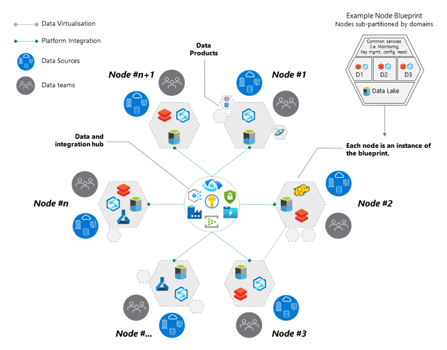

# DATA MESH Journey *from Theory to Practice*
 

This repository is an humble contribution from @DeepHiveMind to the Open Source Community for **The Best of Enterprise Data Mesh 2.0** by introducing the Constructs, Design Elements, Real life implementations of Data Mesh, Codesets, Data Mesh Reference Artefacts & FAQs from the captivating landscape of Distributed Data Mesh 2.0. Gear up for **the Conceptual Universe called "Distributed Data Mesh 2.0"**. Bon Vaoyage!!

# Nuances of The Universe of "Ditributed Data Mesh 2.0"
### What & Why Data Mesh | The Goal of Data Mesh | Enterprise DATA MESH Architecture Principles |  User Persona of Enterprise DATA MESH  | DATA MESH TOPOLOGY | Distributed Data Mesh 2.0 |
 

# DataMesh-as-a-Code on Cloud

>>>> DataMesh-as-a-Code on Azure Cloud 

>>>> DataMesh-as-a-Code on AWS Cloud

>>>> Data Mesh in Practice with DataBricks 

	"A Data Mesh is a paradigm shift in how we think about building data platforms. The architecture is the convergence of Distributed Domain Driven Architecture, Self-serve Platform Design and Product Thinking with Data". 
-- Zhamak Dehghani, Thoughtworks
 

Disclamer:

	The paradigm shift in distributed data architecture comes with several nuances and considerations, which mostly depend on **organizational maturity and skills, organizational structure, risk appetite, sizing and dynamics** . 

## Why DATA MESH (Decentralized Domain Oriented Data Product, powered by Topologies for Decentralized Data-Product node governance with Self-serve Data Infra) Architecture/ Model?:
- The Beauty of 'Central Data Platform': Organizations of all sizes have recognized that data is one of the key enablers to increase and sustain innovation, and drive value for their customers and business units. They are eagerly modernizing traditional data platforms with cloud-native technologies that are highly scalable, feature-rich, and cost-effective.A centralized model is intended to simplify staffing and training by centralizing data and technical expertise in a single place, to reduce technical debt by managing a single data platform, and to reduce operational costs.
- The Challenge with 'Central Data Platform': Managing data through a Central Data Platform can create scaling, ownership, and accountability challenges, because central teams may not understand the specific needs of a data domain, whether due to data types and storage, security, data catalog requirements, or specific technologies needed for data processing.
- Data Mesh as Solution: These challenges can often be reduced by giving ownership and autonomy to the team who owns the data, best allowing them to build data products, rather than only being able to use a common central data platform. 
---- For instance, product teams are responsible for ensuring the product inventory is updated regularly with new products and changes to existing ones. They’re the domain experts of the product inventory datasets. If a discrepancy occurs, they’re the only group who knows how to fix it. Therefore, they’re best able to implement and operate a technical solution to ingest, process, and produce the product inventory dataset. They own everything leading up to the data being consumed: they choose the technology stack, operate in the mindset of data as a product, enforce security and auditing, and provide a mechanism to expose the data to the organization in an easy-to-consume way. This reduces overall friction for information flow in the organization, where the producer is responsible for the datasets they produce and is accountable to the consumer based on the advertised SLAs.

## The AIM of DATA MESH:

- **Move away from tightly coupled data interfaces and varying data flows towards an architecture that allows eco-system connectivity**.
- **A cloud distributed data mesh, which allows DOMAIN-SPECIFIC data and treats “DATA-as-a-PRODUCT”**. 
- **Enabling each domain to handle its own DATA-PIPELINES**. This is different from plumbing data from the traditional (monolithic) platforms that generally tightly couple and often slow down the ingestion, storage, transformation, and consumption of data from one central data lake or hub.

## Enterprise DATA MESH Architecture Principles
**[Data Mesh](https://martinfowler.com/articles/data-mesh-principles.html)** is a new paradigm to  DOMAIN-ORIENTED + DATA PRODUCT + DECENTRALIZED TOPOLOGY + SELF-SERVE DATA Infra +  SCALABLE data architecture that conforms to the following main principles, such as: 

1. Data Mesh Topology (DECENTRALIZED Topology - Data Mesh Node Pattern)

	1a. Governed Data Mesh topology  
	1b. Harmonized Data Mesh topology  
	1c. Highly federated Data Mesh topology
	
2. Domain Oriented DECENTRALIZATION

	2a. Domain-oriented Data Model  
	2b. Domain-oriented Data compute  
	2c. Domain-oriented Data Stoarge  
	2d. Domain-oriented Data pipeline

3. Data as a Product

	3a. Microservice Service Mesh for data domains (Secured, scalable, self-discovered, performant & resilient for data domains Services)
	
		Data products and services are not defined by the size of the function, but instead by the context, cohesion and coupling, requiring either orchestration (Service) or choreography (Micro-Service) to mediate between Services  

	
4. Self-serve Infra for data platform (DataInfra-as-a-Service)

6. Centeralized Data Governance  
	5a. Centralized Data Provenance (Domain Data Data catalogue, Data Protection and PII Anonymization, Data Lienage, Enterprise MDM 360, et al)  
	5b. Unified Policy Management  
	5c. Unified Data Virtualization Service  
	5d. Federated Data Access Control Service  
	5e. Organization wide Secured Data Sharing

## **Data Mesh Topology** 
#### 3 Major DECENTRALIZED Topologyies based on (a) Data Mesh Node Pattern and (b) Data Monetization feasibility
- Governed Data Mesh topology
- Harmonized Data Mesh topology
- Highly federated Mesh topology

Based on nuances and considerations, different data mesh topologies can be used.

|**DATA MESH TOPOLOGY**| **DATA MESH TOPOLOGY**|
| :---: | :---:|
| Governed Data Mesh topology- DataMesh Node Pattern | Governed Data Mesh topology- DataMesh Node Ecosystem| 
|||
| **Harmonized Data Mesh topology** | **Highly federated Mesh topology**| 
|||

Please refer to [Data Mesh Topology](https://github.com/DeepHiveMind/Distributed_DataMesh_2.0_Cloud_Implementation/blob/main/DataMeshTopology.md) for further details into 3 most prevalent Topolgy patterns in Data Mesh.

## Enterprise Data Mesh Data-Product User Persona 
- Data Product Owners
	- - Citizen Developers (assisted by LCNC)
- Data Management & Governance 'Stewards'
- Semantic Specialists
- Data Story Tellers & Navigation SME
- Data Infra PlatformOps specialists
- Data Security Professionals
- CDO

## DataMesh-as-a-Code on Cloud

- [Distributed-Data-Mesh-as-a-Code on Cloud]
	
	- [DataMesh-as-a-Code on Azure Cloud](#DataMesh-as-a-Code-on-Azure-Cloud)
	
	- [DataMesh-as-a-Code on AWS Cloud](#DataMesh-as-a-Code-on-AWS-Cloud)

	- [DataMesh-in-practice with DATABRICKS](https://databricks.com/session_na20/data-mesh-in-practice-how-europes-leading-online-platform-for-fashion-goes-beyond-the-data-lake)

> DataMesh-as-a-Code on Azure Cloud sample implementation  

	- Technology & Tools 

		-- Azure Purview	[Data Provenance engine]
		-- Azure Synapse Analytics	[Node on Domain driven storage- Azure MPP DWH]
		-- Azure CosmosDB			[Node on Domain driven storage- MultiDomain NOSQL DB ]
		-- Azure Data Lake			[Node on Domain driven storage- Data Lake Storage]
		-- Azure Stream Analytics	[Stream Analytics engine]
		-- Azure Data Explorer		[Data Exploration Service]
		-- Presidio					[ Data Protection and PII Anonymization API]
		
		-- Azure Data Factory [Data Ingestion engine]
		-- Azure DataBricks [Data Integration engine]

		-- Azure Function & Azure App Logic [MicroService Serverless engine & MicroService Serverless Orachsteration engine]
		
		-- IaC ARM Templates				[IaC engine]
		-- Azure Vnet & SubNet		[Azure Networking]
		-- Azure DevOps 			[DevOps Service]
		-- Azure Key Valut			[Key Security]
		-- Azure App Insight 	[Azure Application Monitoring & Telemetry Service engine]
		-- Modern Domain Driven Data Warehouse on DataOps
		
	- Yet to be implemented Tools & Technology
		-- Domain Ontology on CosmosDB			[Knowledge Graph]		
		-- WebOntology & Protege
		-- Azure AKS for Data Domain KnowledgeGraph			[Azure Managed K8S Services for managing ontology services]
		-- Istio on AKS 				[Service Mesh for Service Independence, Dynamic Service discovery, circuit breaking, mTLS b/w service-to-service communication] 
		

## Data Mesh Reference Artefacts in Public Domain 

	- [Reference Technical Blogs](#Reference-Technical-Blogs)
	- [Reference Training Courses](#Reference-training-courses)
	- [Reference Books](#Reference-Books)
	- [Community Resources](#community-resources)
	- [Conferences](#conferences)
	- [License](#license)

#### Reference Technical Blogs

- [How to Move Beyond a Monolithic Data Lake to a Distributed Data Mesh by Martin Fowler](https://martinfowler.com/articles/data-monolith-to-mesh.html) - First article on data mesh that started whole concept.
- [Data Mesh Principles and Logical Architecture by Martin Fowler](https://martinfowler.com/articles/data-mesh-principles.html) - second article by by Martin Fowler about principles of data mesh.
- [There is more than one kind of data mesh: three types of data mesh](https://towardsdatascience.com/theres-more-than-one-kind-of-data-mesh-three-types-of-data-meshes-7cb346dc2819) - article on three variations of data meshes.
- [What is a Data Mesh — and How Not to Mesh it Up](https://towardsdatascience.com/what-is-a-data-mesh-and-how-not-to-mesh-it-up-210710bb41e0) - A beginner’s guide to implementing the latest industry trend: a data mesh.
- [Data mesh: it's not just about tech, it's about ownership and communication](https://www.thoughtworks.com/insights/blog/data-mesh-its-not-about-tech-its-about-ownership-and-communication) - article about ownership in Data Mesh.

#### Reference Training Courses

- [Data Mesh Paradigm Shift in Data Platform Architecture](https://www.youtube.com/watch?v=52MCFe4v0UU) - Zhamak Dehghani overview of Data Mesh. 
- [Data Mesh Paradigm Shift in Data Platform Architecture - Arif Wider - DDD Europe 2020](https://www.youtube.com/watch?v=Iqbl9AS03VU&t=1s) - DDD Europe talk about Data Mesh.
- [Zhamak Dehghani | Kafka Summit Europe 2021 Keynote: How to Build the Data Mesh Foundation](https://www.youtube.com/watch?v=QF41q10NSAs) - Kafka Summit talk about building the foundations for Data Mesh.
- [Data Mesh - Domain-Oriented Data](https://training.dddeurope.com/data-mesh-zhamak-dheghani/) - Public Workshops by Zhamak Dehghani.

#### Reference Books

- [Data Management at Scale](https://www.oreilly.com/library/view/data-management-at/9781492054771/) - Book about Enterprise Data Architecture called Scaled Architecture. Data Mesh is only mentioned in this book, but Scaled Architecture follows all principles of Data Mesh. Book describes in details its implementation.

#### Community Resources

- [Data Mesh Slack community](data-mesh.slack.com) - Active slack community about Data Mesh, Scaled Architecture and related topics.

#### Conferences

- [Domain-Driven Design Europe](https://dddeurope.com) - The Leading DDD conference - Data Mesh included (online during COVID19)

## License

To the extent possible under law, [Deep Hive Mind](https://DeepHiveMind.io) has waived all copyright and related or neighboring rights to this work.
