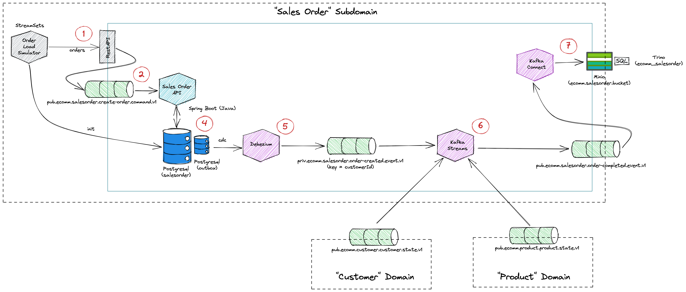
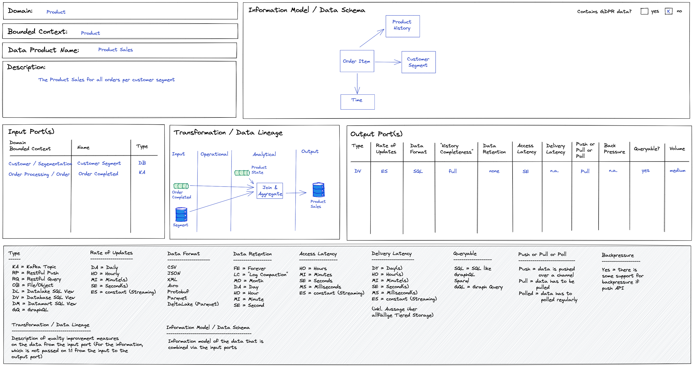
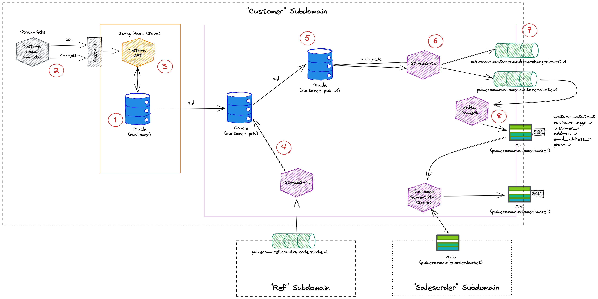

## Data Mesh Domain-Driven Patterns

Domain-driven Pattern simulation of Data Mesh are as following for E-Commerce/e-shop (Overall Biz Domain: ECommerce) with -

	1. Domain : Product
		a. Bounded Context : Product  
		b. Data Product Name : Product Sales  

	2. Domain : Product Recommendation
		a. Bounded Context : Production Recommendation  
		b. Data Product Name : Recommendation  

	3. Domain : Customer
		a. Bounded Context : Customer  
		b. Data Product Name : Customer Data  

	4. Domain : Customer
		a. Bounded Context : Customer  
		b. Data Product Name : Customer Segmentation  

	5. Domain : Customer
		a. Bounded Context : Customer  
		b. Data Product Name : Customer Interactions  

	6. Domain : Churn
		a. Bounded Context : Churn Detection
		b. Data Product Name : Churn Detection 

	7. Domain : E-Shop
		a. Bounded Context : E-Shop 
		b. Data Product Name : Shopping cart 

	8. Domain : E-Shop
		a. Bounded Context : E-Shop 
		b. Data Product Name : Page Navigation 

	9. Domain : E-Shop
		a. Bounded Context : E-Shop 
		b. Data Product Name : User Information 

	5. Domain : Order Processing
		a. Bounded Context : Order Processing  
		b. Data Product Name : OrderProcessingUpdate  

	... more..

 

|**Data MESH Domain-Driven PATTERN**| **Data MESH Domain-Driven PATTERN**| **Data MESH Domain-Driven PATTERN**|
| :---: | :---:| :---:|
| E-Commerce Overview showcase | SHOP-SalesORDER-CUSTOMER-PRODUCT Domain-Implmentation |  SALES ORDER Sub-domain| 
||||
|**Data MESH Domain-Driven PATTERN**| **Data MESH Domain-Driven PATTERN**| **Data MESH Domain-Driven PATTERN**| 
|  Product Sub-domain| product-sales-dataProduct| product-recommendation-dataProduct |
||||
|  Customer Sub-domain| product-sales-dataProduct| product-recommendation-dataProduct |
||||

 
 

## Data Mesh Techno-functional Patterns

Illustration of key Techno-functional Patterns of Data Mesh are as following- 

- Data Product Catalog
- Data Mesh & Event Streaming backbone
- Data Mesh & Data Lienage
- Data Mesh & AI ML
- Data Mesh & CDC
- Data Mesh & Real time Data Synch

|**Data MESH PATTERN**| **Data MESH PATTERN**| **Data MESH PATTERN**|
| :---: | :---:| :---:|
| Pattern_Data Mesh & Data Product Catalog | Pattern_Data Mesh & Event Streaming backbone |  Pattern_Data Mesh & Data Lienage| 
||||
|**Data MESH PATTERN**| **Data MESH PATTERN**| **Data MESH PATTERN**| 
| Pattern_Data Mesh & AI ML | Pattern_Data Mesh & CDC |  Pattern_Data Mesh & Real time Data Synch| 
||| |

 
 