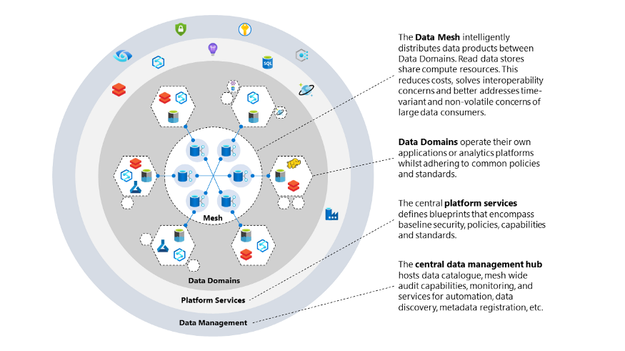
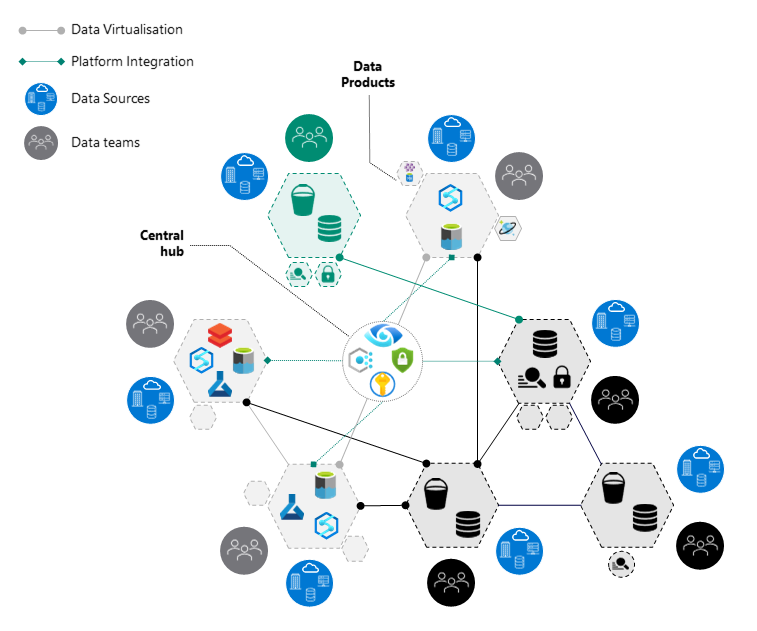

#Data Mesh topologies

> Design considerations for building a data mesh architecture

The paradigm shift in distributed data architecture comes with several nuances and considerations, which mostly depend on organizational maturity and skills, organizational structure, risk appetite, sizing and dynamics. Based on these nuances and considerations, different data mesh topologies can be used.

The aim is to 
-- Move away from tightly coupled data interfaces and varying data flows towards an architecture that allows eco-system connectivity.
-- A cloud distributed data mesh, which allows domain-specific data and treats “data-as-a-product,” 
-- Enabling each domain to handle **its own data pipelines**. This is different from plumbing data from the traditional (monolithic) platforms that generally tightly couple and often slow down the ingestion, storage, transformation, and consumption of data from one central data lake or hub.

**[Data Mesh]** is a new paradigm to data architecture that follows 5 main principles: 
1. Data Mesh Topology Patterns
2. Domain-oriented data and compute 
3. Data as a product
4. Self-serve data platform (Data-as-a-Service)
5. Federated computational governance
6. Service Mesh powered Data Governance & Data Management

# **Data Mesh Topolgy** - 3 Major Patterns
- Governed Data Mesh topology
- Harmonized Data Mesh topology
- Highly federated Mesh topology

|**DATA MESH TOPOLOGY**| **DATA MESH TOPOLOGY**|
| :---: | :---:|
| Governed Data Mesh topology- DataMesh Node Pattern | Governed Data Mesh topology- DataMesh Node Ecosystem| 
|||
| **Harmonized Data Mesh topology** | **Highly federated Mesh topology**| 
|||

## Governed mesh topology
The first pattern is the “governed mesh topology”. In this model, as you can see from the image below, the different data domains are grouped and represented as nodes. Each node you can see as a domain, which can represent itself as either a data provider and/or data consumer towards the other domains.

Nodes, in this model and as a general practice, are instantiated from blueprints, which encompass key capabilities, required in order to enable data value creation (e.g., storage, monitoring, key management, ELT, analytical engines, and automation). Each node is allowed to use its own preferred set of technologies from this blueprint, needed for their specific requirements.